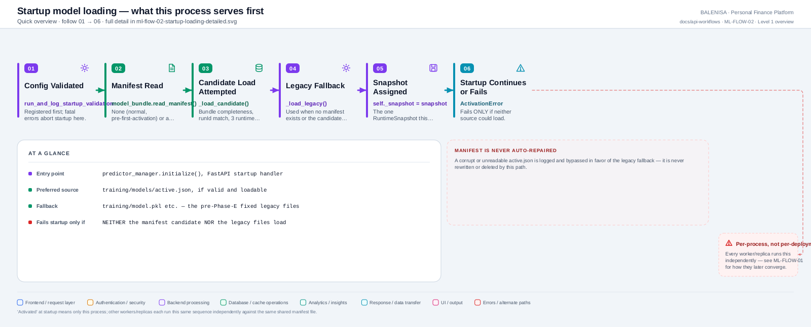
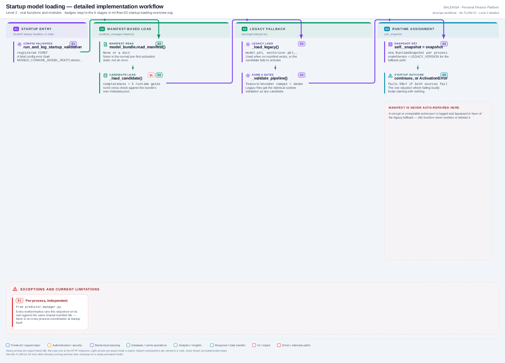

# ML-FLOW-02 — Initial model loading & startup activation

What this process serves predictions from the moment it starts, before any request arrives.

---

## 1. Purpose

Determines the very first `RuntimeSnapshot` for a freshly-started FastAPI process: the manifest-referenced candidate if valid and loadable, otherwise the legacy fixed artifacts.

## 2. Level 1 quick workflow

<picture>
  <source srcset="ml-flow-02-startup-loading-overview.svg" type="image/svg+xml">
  
</picture>

Vector: [`ml-flow-02-startup-loading-overview.svg`](ml-flow-02-startup-loading-overview.svg) ·
raster fallback: [`ml-flow-02-startup-loading-overview.png`](ml-flow-02-startup-loading-overview.png)

## 3. Level 2 detailed workflow

<picture>
  <source srcset="ml-flow-02-startup-loading-detailed.svg" type="image/svg+xml">
  
</picture>

Vector: [`ml-flow-02-startup-loading-detailed.svg`](ml-flow-02-startup-loading-detailed.svg) ·
raster fallback: [`ml-flow-02-startup-loading-detailed.png`](ml-flow-02-startup-loading-detailed.png)

## 4. Trigger

FastAPI's `@app.on_event("startup")` handler `initialize_predictor_on_startup()`, registered second (after config validation, before index creation and run reconciliation) — see `app.py`'s own ordering comments.

## 5. Initial state

`predictor_manager._snapshot` is `None` — no model loaded yet in this process.

## 6. Main components

| Layer | File | Function/class | Purpose |
|---|---|---|---|
| Entry | `app.py` | `initialize_predictor_on_startup()` | Startup handler registration |
| Manager | `inference/predictor_manager.py` | `PredictorManager.initialize()` | The decision logic |
| Manifest | `training/model_bundle.py` | `read_manifest()` | Ground truth for which candidate to try |
| Legacy loader | `inference/predictor_manager.py` | `_load_legacy()` | Fallback path |
| Validation | `training/model_validation.py` | `gate_feature_compatibility`, `gate_encoder_model_compatibility`, `gate_smoke_predictions` | Reused runtime gates |

## 7. Data/artifact movement

`training/models/active.json` (if present) → candidate bundle directory `training/models/model-<runId>/` (three joblib files + metadata) → in-memory `RuntimeSnapshot`. Or: `training/model.pkl`, `vectorizer.pkl`, `labelEncoder.pkl` (legacy, fixed location) → in-memory `RuntimeSnapshot`.

## 8. State transitions

None persisted to MongoDB — this flow only ever reads files and assigns an in-memory attribute.

## 9. Success path

Manifest present and valid → candidate loads and passes the 3 runtime gates → `self._snapshot` set to the candidate, `modelVersion` = the manifest's version. Or: no manifest, or candidate fails → legacy artifacts load and pass the same 3 gates → `self._snapshot` set, `modelVersion` = `"legacy-fixed"`.

## 10. Rejection/failure path

`ActivationError` is raised (propagates out of `initialize()`, aborting FastAPI startup) **only if neither** the manifest candidate **nor** the legacy artifacts can be loaded and validated — the one situation this codebase treats as worth failing loudly for, since the process would otherwise start with nothing to serve predictions with.

## 11. Concurrency controls

None needed — this runs once, before the FastAPI process accepts any traffic, on a single thread.

## 12. Persistence effects

None. The manifest file is only ever read here, never written or repaired.

## 13. Runtime/in-memory effects

Sets `predictor_manager._snapshot`, `_last_manifest_check_at`, and reload-diagnostics fields for the first time in this process's lifetime.

## 14. Recovery behaviour

A corrupt/unreadable manifest, or a candidate that fails to load/validate, is logged as a warning and this flow falls back to the legacy artifacts — the manifest itself is never auto-rewritten, auto-repaired, or deleted by this path; a human is expected to investigate why it was corrupted.

## 15. Backend/frontend impact

None directly — this determines what ML-FLOW-01 (predictions) will serve from the moment the process is ready, but no backend/frontend code observes this startup step itself.

## 16. Files involved

| Layer | File | Function/class | Purpose |
|---|---|---|---|
| Startup handler | `ml-service/app.py` | `initialize_predictor_on_startup()` | Registration |
| Manager | `ml-service/inference/predictor_manager.py` | `PredictorManager.initialize()`, `_load_candidate()`, `_load_legacy()` | Decision + loading |
| Manifest | `ml-service/training/model_bundle.py` | `read_manifest()` | Source of truth |

## 17. Confirmed limitations

- **Per-process, not per-deployment.** Every worker/replica independently runs this exact sequence at its own startup, against the same shared manifest file on disk/volume — there is no coordination that guarantees they all pick the same result at the same instant (though in practice they will, since they read the same manifest).
- **Legacy fallback can mask a real problem.** A corrupted manifest silently degrades this process to the legacy fixed model rather than failing startup — a deliberate, documented policy choice (the legacy files are never modified by anything in this codebase, so this fallback "can never make things worse"), but it does mean a broken manifest is not loud unless one also checks the startup logs or `/ml-status`.
