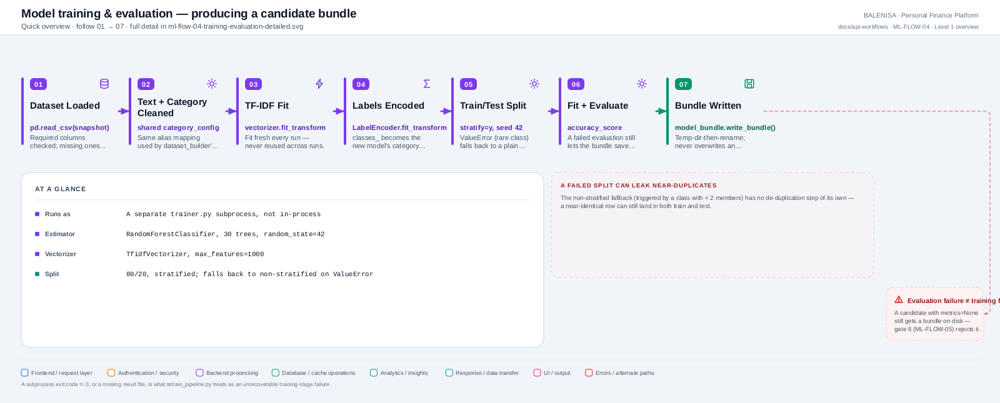
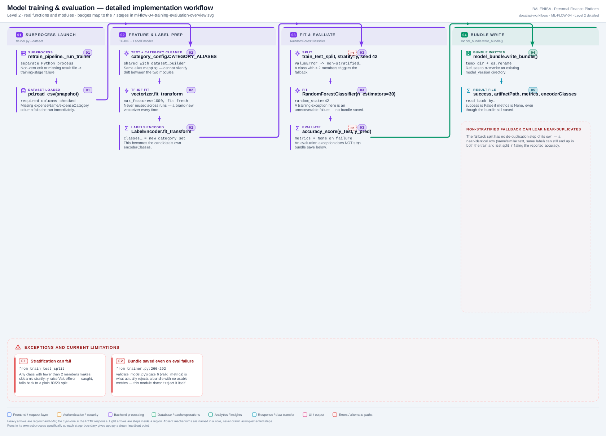

# ML-FLOW-04 — Model training & evaluation

A separate `trainer.py` subprocess that fits a fresh TF-IDF + RandomForest pipeline and writes an immutable candidate bundle.

---

## 1. Purpose

Trains a new model against the exact dataset snapshot ML-FLOW-03 produced, evaluates it, and persists a versioned candidate bundle regardless of whether evaluation itself succeeds.

## 2. Level 1 quick workflow

<picture>
  <source srcset="ml-flow-04-training-evaluation-overview.svg" type="image/svg+xml">
  
</picture>

Vector: [`ml-flow-04-training-evaluation-overview.svg`](ml-flow-04-training-evaluation-overview.svg) ·
raster fallback: [`ml-flow-04-training-evaluation-overview.png`](ml-flow-04-training-evaluation-overview.png)

## 3. Level 2 detailed workflow

<picture>
  <source srcset="ml-flow-04-training-evaluation-detailed.svg" type="image/svg+xml">
  
</picture>

Vector: [`ml-flow-04-training-evaluation-detailed.svg`](ml-flow-04-training-evaluation-detailed.svg) ·
raster fallback: [`ml-flow-04-training-evaluation-detailed.png`](ml-flow-04-training-evaluation-detailed.png)

## 4. Trigger

`retrain_pipeline._run_trainer()`, called after ML-FLOW-03 succeeds, as a `subprocess.run([...trainer.py...])` invocation.

## 5. Initial state

A written, hashed dataset snapshot on disk; no candidate bundle for this `model_version` exists yet.

## 6. Main components

| Layer | File | Function/class | Purpose |
|---|---|---|---|
| Subprocess entry | `training/trainer.py` | module-level script | Full train+evaluate+save script |
| Taxonomy | `training/category_config.py` | `CATEGORY_ALIASES` | Shared with dataset_builder |
| Persistence | `training/model_bundle.py` | `write_bundle()`, `build_metadata()` | Atomic bundle write |

## 7. Data/artifact movement

`training/dataset/runs/<runId>/training_dataset.csv` → cleaned pandas DataFrame → TF-IDF sparse matrix + encoded labels → fitted `RandomForestClassifier` → `training/models/model-<runId>/` (three joblib files + `metadata.json`).

## 8. State transitions

None in MongoDB directly — `trainer.py` has no MongoDB access at all; its only output is the result JSON file `retrain_pipeline.py` reads back, plus the bundle directory on disk.

## 9. Success path

Dataset loads → text/category cleaned via the shared taxonomy → TF-IDF fit → labels encoded → stratified 80/20 split (or non-stratified fallback) → `RandomForestClassifier(n_estimators=30, random_state=42)` fits → accuracy evaluated → bundle written → result file: `{"success": true, "artifactPath": ..., "metrics": {...}, "encoderClasses": [...]}`.

## 10. Rejection/failure path

A dataset-load failure, a missing required column, or a training exception writes `{"success": false, "error": ...}` and exits non-zero — `retrain_pipeline.py` raises, failing the run at stage `"training"`. An *evaluation* failure alone (metrics computation raises) does **not** stop the bundle from being written — `RESULT["success"]` becomes `metrics is not None`, so the bundle can exist on disk while `success` is `false`.

## 11. Concurrency controls

None needed within this flow — it runs as its own OS subprocess, isolated from the main FastAPI process and from any other concurrent run (which cannot exist simultaneously, since only one run can hold the MongoDB lock at a time).

## 12. Persistence effects

Writes exactly one new bundle directory (`model.pkl`, `vectorizer.pkl`, `labelEncoder.pkl`, `metadata.json`) via a temp-directory-then-`os.rename` — refuses to overwrite an existing `model_version` directory.

## 13. Runtime/in-memory effects

None outside the subprocess's own memory — nothing here touches the main process's `predictor_manager`.

## 14. Recovery behaviour

A subprocess crash or non-zero exit is caught by `retrain_pipeline._run_subprocess()` and turned into an ordinary training-stage failure for the run — no partial bundle is left in a way that could be mistaken for complete (the atomic rename in `write_bundle()` guarantees this).

## 15. Backend/frontend impact

None directly — the candidate produced here is not live until ML-FLOW-06 (activation) succeeds.

## 16. Files involved

| Layer | File | Function/class | Purpose |
|---|---|---|---|
| Subprocess | `ml-service/training/trainer.py` | module-level | Train, evaluate, save |
| Orchestrator | `ml-service/training/retrain_pipeline.py` | `_run_trainer()` | Subprocess launch + result-file read |
| Persistence | `ml-service/training/model_bundle.py` | `write_bundle()` | Atomic bundle write |

## 17. Confirmed limitations

- **Non-stratified split fallback has no de-duplication step.** Triggered by any class with fewer than 2 members, this fallback can place a near-identical row in both the train and test split, inflating the reported accuracy — confirmed possible, not merely theoretical, given the confirmed absence of any de-dup logic in this fallback path.
- **Accuracy can be misleading under class imbalance.** No per-class metric, F1 score, or confusion matrix is computed anywhere in `trainer.py` — `accuracy_score` alone is the only evaluation metric, which is well-known to overstate performance on an imbalanced category distribution.
- **A trainer/preprocessing mismatch is possible in principle**: `trainer.py` re-cleans text using the same regex logic as `inference/predictor.py`'s `preprocess_text()`, but the two are separately maintained functions in separate files — not a shared import — so a future edit to one without the other would silently diverge prediction-time and training-time preprocessing.
