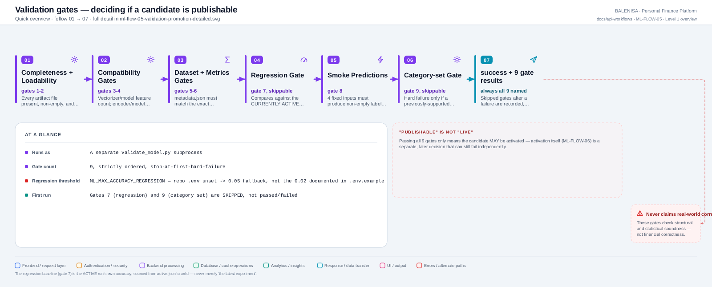
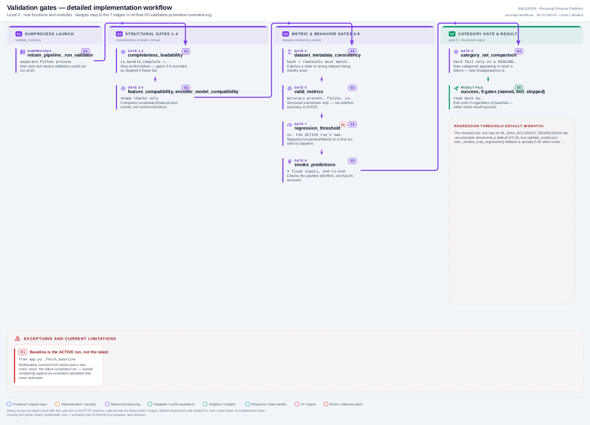

# ML-FLOW-05 — Validation & promotion decision

Nine ordered gates, run in a separate `validate_model.py` subprocess, deciding whether a candidate bundle is publishable.

---

## 1. Purpose

Checks structural integrity, statistical soundness, and behavioral correctness of a freshly-trained candidate before it is allowed anywhere near activation.

## 2. Level 1 quick workflow

<picture>
  <source srcset="ml-flow-05-validation-promotion-overview.svg" type="image/svg+xml">
  
</picture>

Vector: [`ml-flow-05-validation-promotion-overview.svg`](ml-flow-05-validation-promotion-overview.svg) ·
raster fallback: [`ml-flow-05-validation-promotion-overview.png`](ml-flow-05-validation-promotion-overview.png)

## 3. Level 2 detailed workflow

<picture>
  <source srcset="ml-flow-05-validation-promotion-detailed.svg" type="image/svg+xml">
  
</picture>

Vector: [`ml-flow-05-validation-promotion-detailed.svg`](ml-flow-05-validation-promotion-detailed.svg) ·
raster fallback: [`ml-flow-05-validation-promotion-detailed.png`](ml-flow-05-validation-promotion-detailed.png)

## 4. Trigger

`retrain_pipeline._run_validator()`, called after ML-FLOW-04 produces a candidate bundle (regardless of whether that stage's own `success` flag was true).

## 5. Initial state

A candidate bundle exists on disk at `training/models/model-<runId>/`; the run's own status is `evaluating` (set by `app.py`'s `_on_stage_complete` the instant the training stage finished).

## 6. Main components

| Layer | File | Function/class | Purpose |
|---|---|---|---|
| Subprocess entry | `training/validate_model.py` | `main()` | CLI wrapper |
| Gates | `training/model_validation.py` | `run_all_gates()` and the 9 `gate_*` functions | The actual checks |
| Bundle access | `training/model_bundle.py` | `is_bundle_complete()`, `load_bundle()`, `read_metadata()` | Shared with the writer |

## 7. Data/artifact movement

Reads the candidate bundle's three joblib files + `metadata.json`; writes nothing except its own result JSON file (read back by `retrain_pipeline.py`).

## 8. State transitions

None in MongoDB directly from this subprocess — `app.py`'s `background_retrain` translates the result into `mark_completed`/`failed_validation` afterward (as of Phase E, success flows straight into `activating` instead of stopping at `completed`).

## 9. Success path

Gates 1–9 run strictly in order; gates 7 (regression) and 9 (category-set) are **skipped**, not passed, when no previous completed/active run exists (first run) — all 9 entries always present in the result, named, with `skipped` explicit.

## 10. Rejection/failure path

The first hard failure stops evaluation; every gate at or after that point is recorded with `skipped: true` and a reason explaining why it wasn't reached — the persisted result always accounts for all 9 gates by name, never a partial list.

## 11. Concurrency controls

None needed — runs in its own subprocess, and only one run can be at this stage at a time (the MongoDB lock).

## 12. Persistence effects

None to the bundle itself — validation is read-only against the candidate's files.

## 13. Runtime/in-memory effects

None — entirely confined to the subprocess.

## 14. Recovery behaviour

A subprocess crash before it can even write a result file is a distinct failure mode from an ordinary gate failure — `retrain_pipeline.py` raises if the result file is missing, versus reading a structured `{"success": false, ...}` if the subprocess ran to completion but validation itself failed.

## 15. Backend/frontend impact

None directly — this only decides whether ML-FLOW-06 (activation) is attempted at all.

## 16. Files involved

| Layer | File | Function/class | Purpose |
|---|---|---|---|
| Subprocess | `ml-service/training/validate_model.py` | `main()` | CLI wrapper, result-file writer |
| Gates | `ml-service/training/model_validation.py` | `run_all_gates()`, 9 `gate_*` functions | The 9 checks |
| Baseline source | `ml-service/app.py` | `_fetch_baseline()` | Supplies gate 7/9's comparison data |

## 17. Confirmed limitations

- **Regression-threshold default mismatch, confirmed from the repository's own files.** `ml-service/.env` sets no `ML_MAX_ACCURACY_REGRESSION`. `.env.example` documents a default of `0.02`. But `validate_model.py`'s own `_resolve_max_regression()` fallback, actually used when the env var is unset, is `0.05` — the documented default and the code's real default disagree; **0.05 is what actually governs gate 7** in the current configuration.
- **Validation checks structure and statistics, not financial correctness.** These 9 gates never assess whether a predicted category is the *right* category for a real transaction — only that the pipeline is internally consistent, loadable, and no worse than the previous active model by a configured margin.
- **Baseline is the currently-active run, never merely "the latest experiment."** Deliberately sourced from `active.json`'s own `runId` (`app.py`'s `_fetch_baseline`) — a candidate that never activated cannot become an accidental baseline for the next run.
