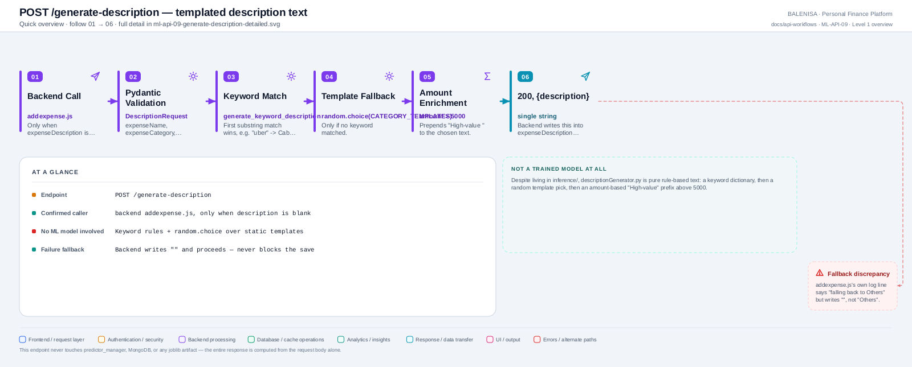
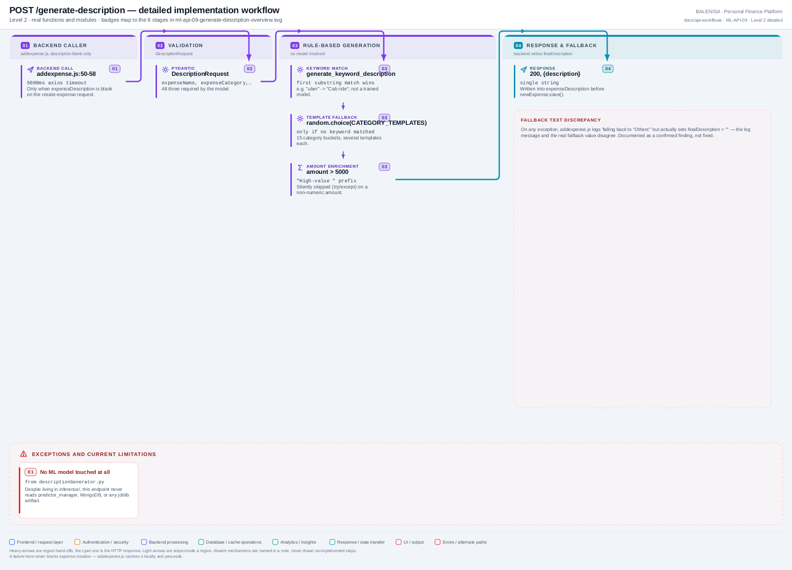

# ML-API-09 — POST /generate-description

Templated description text — despite living under `inference/`, involves no trained model at all.

---

## 1. Purpose

Produces a short human-readable description for an expense when the user submitted none, using keyword rules and category templates.

## 2. Endpoint and method

`POST /generate-description` — `app.py:527`, `@app.post("/generate-description")`.

## 3. Level 1 quick workflow

<picture>
  <source srcset="ml-api-09-generate-description-overview.svg" type="image/svg+xml">
  
</picture>

Vector: [`ml-api-09-generate-description-overview.svg`](ml-api-09-generate-description-overview.svg) ·
raster fallback: [`ml-api-09-generate-description-overview.png`](ml-api-09-generate-description-overview.png)

## 4. Level 2 detailed workflow

<picture>
  <source srcset="ml-api-09-generate-description-detailed.svg" type="image/svg+xml">
  
</picture>

Vector: [`ml-api-09-generate-description-detailed.svg`](ml-api-09-generate-description-detailed.svg) ·
raster fallback: [`ml-api-09-generate-description-detailed.png`](ml-api-09-generate-description-detailed.png)

## 5. Request schema and validation

```python
class DescriptionRequest(BaseModel):
    expenseName: str
    expenseCategory: str
    expenseAmount: float
```

All three required by Pydantic; no further validation (no allow-list check on `expenseCategory` — an unrecognized category simply falls through to the `"Others"` template bucket via `.get(category, CATEGORY_TEMPLATES["Others"])`).

## 6. Route/dependency order

| Layer | File | Function/class | Purpose |
|---|---|---|---|
| Route | `ml-service/app.py:527` | `generate_description_api()` | Delegates directly |
| Service | `ml-service/inference/descriptionGenerator.py` | `generate_description_response()` | Full rule-based pipeline |

## 7. Handler/service behaviour

Three-step rule pipeline, no ML model, no MongoDB:
1. `generate_keyword_description()` — first substring match against a fixed `KEYWORD_RULES` dict (e.g. `"uber"` → `"Cab ride"`) wins.
2. If no keyword matched, `random.choice()` over `CATEGORY_TEMPLATES[category]` (falls back to the `"Others"` bucket for an unrecognized category).
3. If `amount > 5000`, prepends `"High-value "` to the chosen text (wrapped in a bare `try/except`, silently skipped on a non-numeric amount).

## 8. Model/data dependencies

None. Entirely computed from the request body against two static Python dicts (`CATEGORY_TEMPLATES`, `KEYWORD_RULES`).

## 9. Response schema

`{"description": str}`.

## 10. Confirmed caller

**Yes** — `backend/Controllers/ExpenseControllers/addexpense.js`, inside the `addExpense` controller, only when `!expenseDescription || expenseDescription.trim() === ''`. 5000ms axios timeout.

## 11. Success path

Request → keyword match or template fallback → optional amount enrichment → 200, `{"description": ...}` → backend writes this into `expenseDescription` before `newExpense.save()`.

## 12. Failure paths and status codes

| Cause | Status |
|---|---|
| Missing/wrong-typed field | 422 (Pydantic) |
| Any other exception | Not explicitly caught inside this handler — would surface as a FastAPI 500, though no such path is evident given the pipeline's simplicity |
| Backend-side timeout/unreachable | Backend catches locally; see observation below |

## 13. Concurrency behaviour

Stateless, no shared mutable state, no model, no lock — safe under unlimited concurrency.

## 14. Security/privacy behaviour

No authentication on this route itself. No sensitive data returned beyond a generated description string.

## 15. Files involved

| Layer | File | Function/class | Purpose |
|---|---|---|---|
| Route | `ml-service/app.py` | `generate_description_api()` | Routing |
| Service | `ml-service/inference/descriptionGenerator.py` | `generate_description_response()`, `generate_keyword_description()`, `generate_description()` | Full rule pipeline |
| Backend caller | `backend/Controllers/ExpenseControllers/addexpense.js` | `addExpense` | Trigger + fallback |

## 16. Current implementation observations

- **Confirmed fallback-text discrepancy.** On any exception, `addexpense.js`'s catch block logs `'ML description generation failed, falling back to "Others"'` but actually sets `finalDescription = ""` — the log message and the real fallback value disagree. A confirmed finding, not fixed per this audit's scope.
- A failure here never blocks expense creation — the backend catches it locally and proceeds with an empty description.
