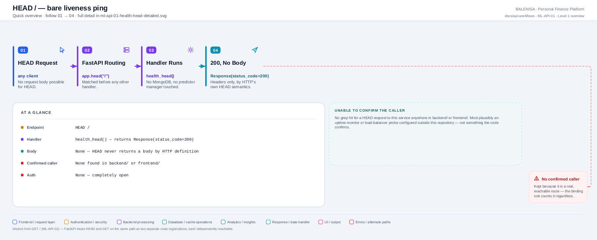
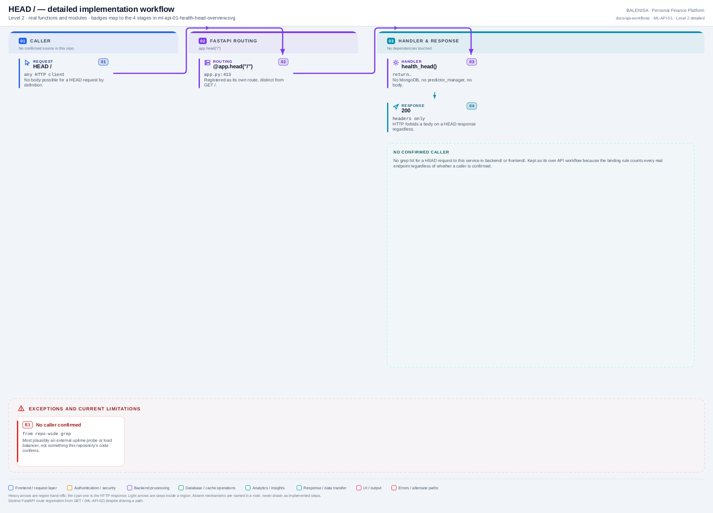

# ML-API-01 — HEAD /

A bare liveness ping with no response body, confirmed present in `ml-service/app.py` as its own FastAPI route registration, distinct from `GET /`.

---

## 1. Purpose

Lets a caller confirm the FastAPI process answers HTTP at all, using the cheapest possible request (no body either direction). Touches nothing — no MongoDB, no predictor manager.

## 2. Endpoint and method

`HEAD /` — `app.py:413`, `@app.head("/")`.

## 3. Level 1 quick workflow

<picture>
  <source srcset="ml-api-01-health-head-overview.svg" type="image/svg+xml">
  
</picture>

Vector: [`ml-api-01-health-head-overview.svg`](ml-api-01-health-head-overview.svg) ·
raster fallback: [`ml-api-01-health-head-overview.png`](ml-api-01-health-head-overview.png)

## 4. Level 2 detailed workflow

<picture>
  <source srcset="ml-api-01-health-head-detailed.svg" type="image/svg+xml">
  
</picture>

Vector: [`ml-api-01-health-head-detailed.svg`](ml-api-01-health-head-detailed.svg) ·
raster fallback: [`ml-api-01-health-head-detailed.png`](ml-api-01-health-head-detailed.png)

## 5. Request schema and validation

None. HEAD carries no body by HTTP definition; FastAPI's route match requires nothing beyond the path.

## 6. Route/dependency order

| Layer | File | Function/class | Purpose |
|---|---|---|---|
| Route | `ml-service/app.py:413` | `health_head()` | Returns `Response(status_code=200)` directly |

No middleware, no dependency injection, no MongoDB or predictor-manager access anywhere in the call path.

## 7. Handler/service behaviour

```python
@app.head("/")
def health_head():
    return Response(status_code=200)
```

## 8. Model/data dependencies

None.

## 9. Response schema

Status 200, empty body (HEAD responses never carry a body regardless of what the handler returns).

## 10. Confirmed caller

**None found.** Searched `backend/` and `frontend/` for a HEAD request to this service; no match. Not referenced by the Dockerfile (no `HEALTHCHECK` directive) or any deployment manifest in this repository.

## 11. Success path

Request matches the route → handler returns → 200, no body. Cannot meaningfully fail — no dependency, no branch.

## 12. Failure paths and status codes

None exist in this handler. A malformed request that doesn't match the route at all (wrong path) is FastAPI's own 404, unrelated to this handler's logic.

## 13. Concurrency behaviour

Stateless; unlimited concurrent callers, no shared state touched.

## 14. Security/privacy behaviour

No authentication. No data returned. No injection surface (no input processed).

## 15. Files involved

| Layer | File | Function/class | Purpose |
|---|---|---|---|
| Route | `ml-service/app.py` | `health_head()` | The entire implementation |

## 16. Current implementation observations

- Classified **Externally reachable but unused / Unable to confirm caller** — the binding rule still counts it as its own API workflow because it is a real, reachable HTTP endpoint, regardless of caller.
- `HEAD /` and `GET /` (ML-API-02) are two independently registered FastAPI routes on the same path — confirmed by two separate `@app.head`/`@app.get` decorators, not one route serving both methods.
