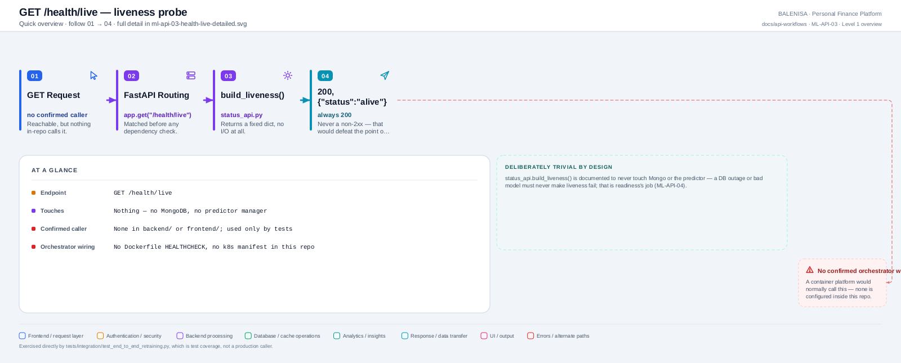
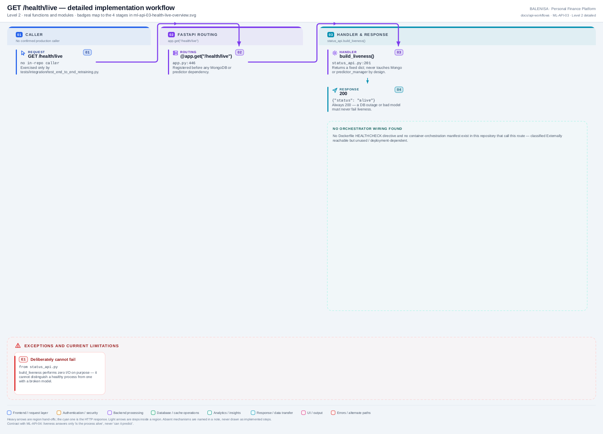

# ML-API-03 — GET /health/live

Liveness probe: "is this process able to serve HTTP at all." Confirmed to touch nothing else.

---

## 1. Purpose

A cheap, dependency-free liveness check — deliberately unable to fail from a database outage or a bad model, since that is readiness's (ML-API-04) job, not liveness's.

## 2. Endpoint and method

`GET /health/live` — `app.py:446`, `@app.get("/health/live")`.

## 3. Level 1 quick workflow

<picture>
  <source srcset="ml-api-03-health-live-overview.svg" type="image/svg+xml">
  
</picture>

Vector: [`ml-api-03-health-live-overview.svg`](ml-api-03-health-live-overview.svg) ·
raster fallback: [`ml-api-03-health-live-overview.png`](ml-api-03-health-live-overview.png)

## 4. Level 2 detailed workflow

<picture>
  <source srcset="ml-api-03-health-live-detailed.svg" type="image/svg+xml">
  
</picture>

Vector: [`ml-api-03-health-live-detailed.svg`](ml-api-03-health-live-detailed.svg) ·
raster fallback: [`ml-api-03-health-live-detailed.png`](ml-api-03-health-live-detailed.png)

## 5. Request schema and validation

None.

## 6. Route/dependency order

| Layer | File | Function/class | Purpose |
|---|---|---|---|
| Route | `ml-service/app.py:446` | `health_live()` | Delegates to `status_api.build_liveness()` |
| Service | `ml-service/status_api.py:201` | `build_liveness()` | Returns a fixed dict, zero I/O |

## 7. Handler/service behaviour

```python
@app.get("/health/live")
def health_live():
    return status_api.build_liveness()
```

`build_liveness()` is documented in its own docstring to never touch MongoDB or the predictor manager.

## 8. Model/data dependencies

None — by design.

## 9. Response schema

`{"status": "alive"}`, always 200.

## 10. Confirmed caller

**None found** in `backend/` or `frontend/`. Exercised only by `tests/integration/test_end_to_end_retraining.py` (test coverage, not a production caller). No Dockerfile `HEALTHCHECK` directive and no orchestration manifest in this repository wire anything to call it.

## 11. Success path

Always succeeds when reached — there is no failure branch in `build_liveness()`.

## 12. Failure paths and status codes

None. This is intentional: a liveness probe that could fail from a downstream dependency would defeat its purpose (a DB or model problem should surface as a *readiness* failure, not cause an orchestrator to kill/restart an otherwise-healthy process).

## 13. Concurrency behaviour

Stateless; no shared state, no locking.

## 14. Security/privacy behaviour

No authentication, no data exposed beyond a fixed string.

## 15. Files involved

| Layer | File | Function/class | Purpose |
|---|---|---|---|
| Route | `ml-service/app.py` | `health_live()` | Route registration |
| Service | `ml-service/status_api.py` | `build_liveness()` | Fixed-response builder |

## 16. Current implementation observations

- Classified **Externally reachable but unused** — fully implemented per its own documented contract, but no confirmed caller exists in this repository outside of tests.
- No container orchestrator wiring (Kubernetes liveness probe, Docker `HEALTHCHECK`) is present in this repo to actually make use of it, though the endpoint is clearly designed for that role.
