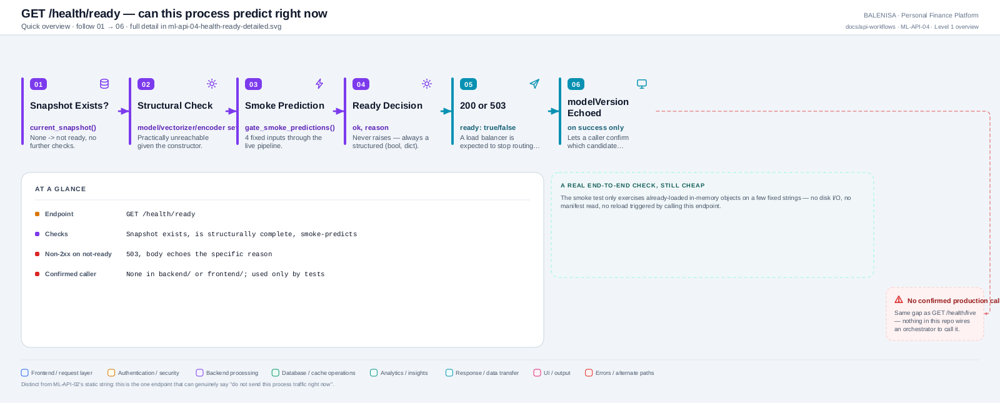
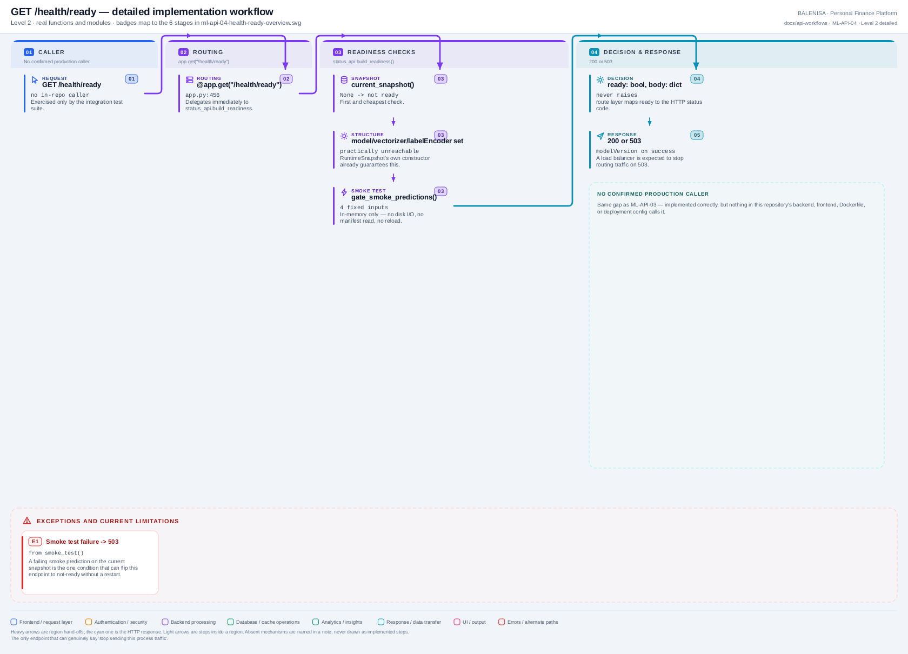

# ML-API-04 — GET /health/ready

The one endpoint that can genuinely say "do not route traffic to this process right now" — checks a live snapshot exists and passes a real smoke prediction.

---

## 1. Purpose

Readiness probe: "can this process currently serve valid predictions." Returns a non-2xx when not ready.

## 2. Endpoint and method

`GET /health/ready` — `app.py:456`, `@app.get("/health/ready")`.

## 3. Level 1 quick workflow

<picture>
  <source srcset="ml-api-04-health-ready-overview.svg" type="image/svg+xml">
  
</picture>

Vector: [`ml-api-04-health-ready-overview.svg`](ml-api-04-health-ready-overview.svg) ·
raster fallback: [`ml-api-04-health-ready-overview.png`](ml-api-04-health-ready-overview.png)

## 4. Level 2 detailed workflow

<picture>
  <source srcset="ml-api-04-health-ready-detailed.svg" type="image/svg+xml">
  
</picture>

Vector: [`ml-api-04-health-ready-detailed.svg`](ml-api-04-health-ready-detailed.svg) ·
raster fallback: [`ml-api-04-health-ready-detailed.png`](ml-api-04-health-ready-detailed.png)

## 5. Request schema and validation

None.

## 6. Route/dependency order

| Layer | File | Function/class | Purpose |
|---|---|---|---|
| Route | `ml-service/app.py:456` | `health_ready()` | Maps `ready` bool to HTTP status |
| Service | `ml-service/status_api.py:213` | `build_readiness(predictor_manager)` | The three checks below |
| Runtime | `ml-service/inference/predictor_manager.py` | `current_snapshot()`, `smoke_test()` | Snapshot existence + live smoke prediction |

## 7. Handler/service behaviour

Three checks, in order, first failure short-circuits the rest:
1. `current_snapshot()` is not `None`.
2. `model`, `vectorizer`, `labelEncoder` are all present on the snapshot (practically unreachable given `RuntimeSnapshot`'s constructor).
3. `smoke_test()` passes — runs `gate_smoke_predictions` against 4 fixed inputs on the already-loaded objects only; no disk I/O, no manifest read, no reload triggered.

```python
ready, body = status_api.build_readiness(predictor_manager)
if not ready:
    return JSONResponse(status_code=503, content=body)
return JSONResponse(status_code=200, content=body)
```

## 8. Model/data dependencies

Reads the process's current in-memory `RuntimeSnapshot` only — never touches MongoDB or the manifest file.

## 9. Response schema

Ready: `{"ready": true, "modelVersion": "..."}`, 200.
Not ready: `{"ready": false, "reason": "..."}`, 503.

## 10. Confirmed caller

**None found** in `backend/` or `frontend/`. Exercised by `tests/integration/test_end_to_end_retraining.py` line 323 (`c.get("/health/ready")`) — test coverage only.

## 11. Success path

Snapshot present, structurally complete, smoke prediction succeeds → 200, `ready: true`, `modelVersion` included.

## 12. Failure paths and status codes

| Cause | Response |
|---|---|
| No snapshot loaded at all | 503, `{"ready": false, "reason": "no runtime snapshot loaded"}` |
| Snapshot structurally incomplete | 503, `{"ready": false, "reason": "runtime snapshot is incomplete"}` |
| Smoke prediction fails | 503, `{"ready": false, "reason": <sanitized>}` |

## 13. Concurrency behaviour

Read-only against whatever snapshot is currently live; safe under concurrent prediction requests since `smoke_test()` only reads already-loaded objects.

## 14. Security/privacy behaviour

No authentication. `reason` text is passed through `sanitize_reason` before inclusion — no raw stack traces.

## 15. Files involved

| Layer | File | Function/class | Purpose |
|---|---|---|---|
| Route | `ml-service/app.py` | `health_ready()` | Status-code mapping |
| Service | `ml-service/status_api.py` | `build_readiness()` | The three checks |
| Runtime | `ml-service/inference/predictor_manager.py` | `current_snapshot()`, `smoke_test()` | State + smoke prediction |

## 16. Current implementation observations

- Classified **Externally reachable but unused** — same gap as ML-API-03: no orchestrator wiring found in this repository, despite a correct and complete implementation.
- The only endpoint besides `/ml-status` that can distinguish "process alive" from "process able to predict."
