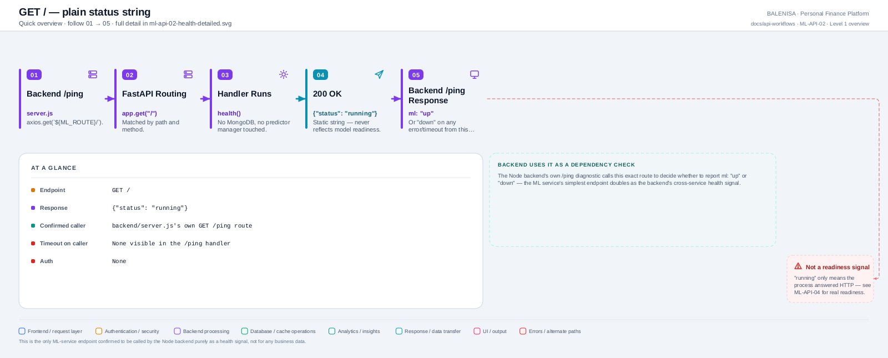
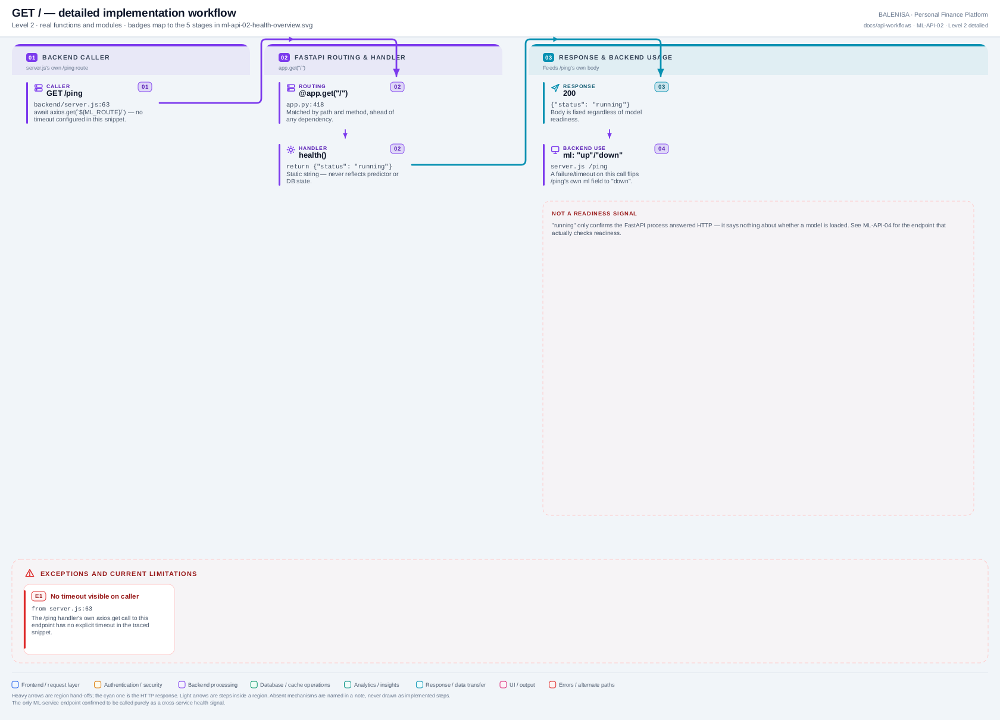

# ML-API-02 — GET /

A static status string, confirmed as the one ML-service endpoint the Node backend actually calls purely as a cross-service health signal.

---

## 1. Purpose

Lets any caller confirm the process answered HTTP and returns a fixed `{"status": "running"}` body — never reflects predictor or database readiness.

## 2. Endpoint and method

`GET /` — `app.py:418`, `@app.get("/")`.

## 3. Level 1 quick workflow

<picture>
  <source srcset="ml-api-02-health-overview.svg" type="image/svg+xml">
  
</picture>

Vector: [`ml-api-02-health-overview.svg`](ml-api-02-health-overview.svg) ·
raster fallback: [`ml-api-02-health-overview.png`](ml-api-02-health-overview.png)

## 4. Level 2 detailed workflow

<picture>
  <source srcset="ml-api-02-health-detailed.svg" type="image/svg+xml">
  
</picture>

Vector: [`ml-api-02-health-detailed.svg`](ml-api-02-health-detailed.svg) ·
raster fallback: [`ml-api-02-health-detailed.png`](ml-api-02-health-detailed.png)

## 5. Request schema and validation

None — no query params, no body.

## 6. Route/dependency order

| Layer | File | Function/class | Purpose |
|---|---|---|---|
| Route | `ml-service/app.py:418` | `health()` | Returns a fixed dict literal |

## 7. Handler/service behaviour

```python
@app.get("/")
def health():
    return {"status": "running"}
```

No MongoDB, no predictor manager, no conditional logic of any kind.

## 8. Model/data dependencies

None.

## 9. Response schema

`{"status": "running"}` — always this exact body when reached at all.

## 10. Confirmed caller

**Yes** — `backend/server.js:63`, inside the backend's own `GET /ping` diagnostic route: `await axios.get(`${process.env.ML_ROUTE}/`);`. No explicit timeout visible on this specific call in the traced snippet. The backend's `/ping` response sets its own `ml` field to `"up"` on success or `"down"` on any error/timeout from this call.

## 11. Success path

Request → handler → `{"status": "running"}`, 200 → backend's `/ping` reports `ml: "up"`.

## 12. Failure paths and status codes

None inside this handler. If the ML service is entirely unreachable, the *caller's* axios call fails/times out — that failure is handled entirely in `backend/server.js`, not here.

## 13. Concurrency behaviour

Stateless; no shared state.

## 14. Security/privacy behaviour

No authentication. No data exposed beyond the fixed string.

## 15. Files involved

| Layer | File | Function/class | Purpose |
|---|---|---|---|
| Route | `ml-service/app.py` | `health()` | The entire implementation |
| Caller | `backend/server.js` | `GET /ping` handler | Cross-service health aggregation |

## 16. Current implementation observations

- **Not a readiness signal.** `"running"` means only that the process answered HTTP — it says nothing about whether a model is loaded or MongoDB is reachable. Compare with ML-API-04 (`GET /health/ready`), which actually checks that.
- This is the only ML-service endpoint confirmed to be called by the Node backend, and it is used purely as a health check, never for business data.
