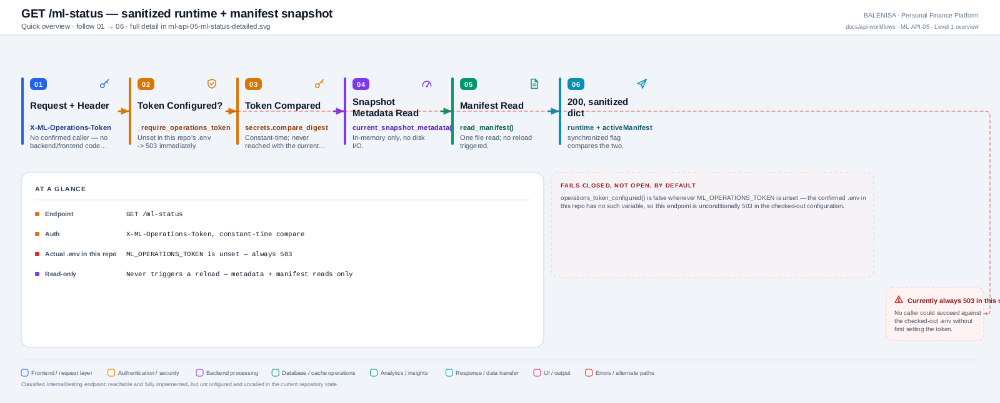
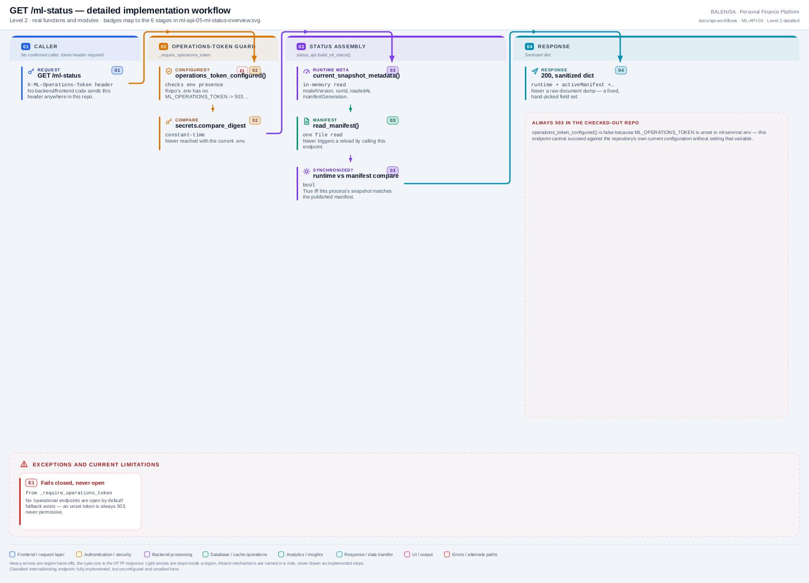

# ML-API-05 — GET /ml-status

A sanitized runtime + manifest snapshot, gated by a shared-secret operations token — confirmed to be unconditionally 503 in this repository's checked-out `.env`.

---

## 1. Purpose

Lets an operator inspect the currently-loaded model version, whether it matches the published manifest, and reload diagnostics, without triggering a reload.

## 2. Endpoint and method

`GET /ml-status` — `app.py:471`, `@app.get("/ml-status")`.

## 3. Level 1 quick workflow

<picture>
  <source srcset="ml-api-05-ml-status-overview.svg" type="image/svg+xml">
  
</picture>

Vector: [`ml-api-05-ml-status-overview.svg`](ml-api-05-ml-status-overview.svg) ·
raster fallback: [`ml-api-05-ml-status-overview.png`](ml-api-05-ml-status-overview.png)

## 4. Level 2 detailed workflow

<picture>
  <source srcset="ml-api-05-ml-status-detailed.svg" type="image/svg+xml">
  
</picture>

Vector: [`ml-api-05-ml-status-detailed.svg`](ml-api-05-ml-status-detailed.svg) ·
raster fallback: [`ml-api-05-ml-status-detailed.png`](ml-api-05-ml-status-detailed.png)

## 5. Request schema and validation

Optional header `X-ML-Operations-Token`. No body, no query params.

## 6. Route/dependency order

| Layer | File | Function/class | Purpose |
|---|---|---|---|
| Route | `ml-service/app.py:471` | `ml_status()` | Calls the guard, then the builder |
| Guard | `ml-service/app.py:425` | `_require_operations_token()` | Shared by all 3 operational endpoints |
| Service | `ml-service/status_api.py:125` | `build_ml_status()` | Assembles the response |

## 7. Handler/service behaviour

```python
def _require_operations_token(x_ml_operations_token):
    if not status_api.operations_token_configured():
        raise HTTPException(status_code=503, detail="Operational endpoints are not configured.")
    if not status_api.check_operations_token(x_ml_operations_token):
        raise HTTPException(status_code=401, detail="Missing or invalid operations token.")
```

Fails closed: an unset `ML_OPERATIONS_TOKEN` **always** returns 503, never "open by default." Token comparison uses `secrets.compare_digest` (constant-time). `build_ml_status()` reads `predictor_manager.current_snapshot_metadata()` and `.diagnostics()` (in-memory only) plus `model_bundle.read_manifest()` (one file read) — never triggers a reload or write.

## 8. Model/data dependencies

Runtime snapshot metadata + the manifest file, both read-only.

## 9. Response schema

```json
{
  "runtime": {"ready": bool, "modelVersion": str|null, "runId": str|null, "loadedAt": str|null, "manifestGeneration": int|null, "source": "legacy-fixed"|"versioned-bundle"|null},
  "activeManifest": {"modelVersion": str, "runId": str, "generation": int, "publishedAt": str} | null,
  "synchronized": bool,
  "lastReloadError": str|null,
  "reloadDiagnostics": {"lastManifestCheckAt": ..., "lastReloadAttemptAt": ..., "lastReloadSuccessAt": ..., "lastReloadErrorAt": ..., "reloadFailureCount": int}
}
```

## 10. Confirmed caller

**None.** No grep hit for `ml-status` or `X-ML-Operations-Token` anywhere in `backend/` or `frontend/`.

## 11. Success path

Valid token → metadata + manifest read → 200, sanitized status dict.

## 12. Failure paths and status codes

| Cause | Status |
|---|---|
| `ML_OPERATIONS_TOKEN` unset (confirmed the case in this repo's `.env`) | 503 |
| Token present but wrong/missing | 401 |
| Manifest file present but corrupt | 200, with `lastReloadError` populated from the sanitized manifest error — not itself a request failure |

## 13. Concurrency behaviour

Purely read-only against in-memory state and one file read; safe under any concurrency level.

## 14. Security/privacy behaviour

Fail-closed by construction (no permissive default). Token never logged. Manifest/diagnostics fields are a fixed allow-list — never a raw document dump.

## 15. Files involved

| Layer | File | Function/class | Purpose |
|---|---|---|---|
| Route + guard | `ml-service/app.py` | `ml_status()`, `_require_operations_token()` | Routing + access control |
| Service | `ml-service/status_api.py` | `build_ml_status()`, `operations_token_configured()`, `check_operations_token()` | Assembly + token logic |
| Runtime | `ml-service/inference/predictor_manager.py` | `current_snapshot_metadata()`, `diagnostics()` | Source data |

## 16. Current implementation observations

- Classified **Internal/testing endpoint** — fully implemented, correctly fail-closed, but unconfigured (`ML_OPERATIONS_TOKEN` absent from the actual `.env`) and uncalled anywhere in this repository.
- `.env.example` documents this token as optional with a placeholder value; the real `.env` never sets it, so this endpoint is presently unreachable in practice without operator action outside this repository's tracked config.
