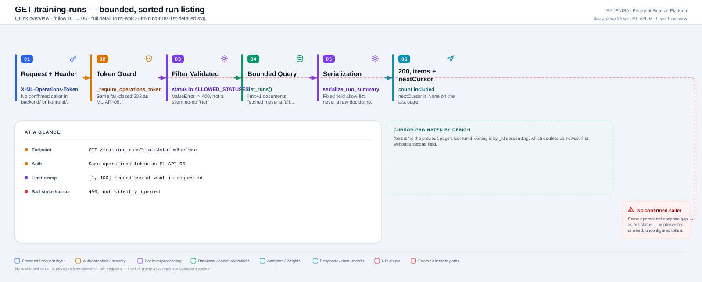
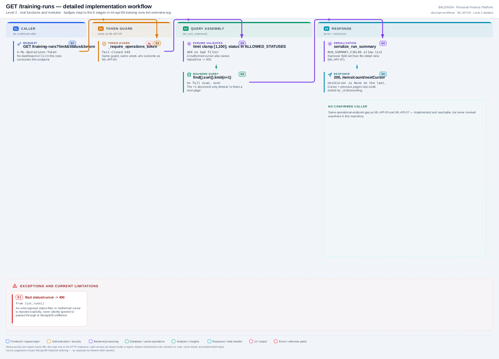

# ML-API-06 — GET /training-runs

Bounded, sorted, cursor-paginated listing of training-run records — same unconfigured-token gap as ML-API-05.

---

## 1. Purpose

Lets an operator page through training-run history without a full collection scan.

## 2. Endpoint and method

`GET /training-runs?limit&status&before` — `app.py:498`, `@app.get("/training-runs")`.

## 3. Level 1 quick workflow

<picture>
  <source srcset="ml-api-06-training-runs-list-overview.svg" type="image/svg+xml">
  
</picture>

Vector: [`ml-api-06-training-runs-list-overview.svg`](ml-api-06-training-runs-list-overview.svg) ·
raster fallback: [`ml-api-06-training-runs-list-overview.png`](ml-api-06-training-runs-list-overview.png)

## 4. Level 2 detailed workflow

<picture>
  <source srcset="ml-api-06-training-runs-list-detailed.svg" type="image/svg+xml">
  
</picture>

Vector: [`ml-api-06-training-runs-list-detailed.svg`](ml-api-06-training-runs-list-detailed.svg) ·
raster fallback: [`ml-api-06-training-runs-list-detailed.png`](ml-api-06-training-runs-list-detailed.png)

## 5. Request schema and validation

Query params: `limit` (int, default 20, clamped to `[1, 100]`), `status` (optional, must be in `ALLOWED_STATUSES` or raises `ValueError` → 400), `before` (optional opaque cursor — a previous page's last `runId`; malformed → `ValueError` → 400). Header: `X-ML-Operations-Token`.

## 6. Route/dependency order

| Layer | File | Function/class | Purpose |
|---|---|---|---|
| Route | `ml-service/app.py:498` | `training_run_list()` | Token guard, then delegates |
| Guard | `ml-service/app.py:425` | `_require_operations_token()` | Same as ML-API-05 |
| Service | `ml-service/status_api.py:106` | `list_runs_response()` | Builds `{items, count, nextCursor}` |
| Repository | `ml-service/db/training_run_repository.py:819` | `list_runs()` | The bounded, sorted MongoDB query |

## 7. Handler/service behaviour

```python
try:
    return status_api.list_runs_response(limit=limit, status=status, before=before)
except ValueError as exc:
    raise HTTPException(status_code=400, detail=sanitize_reason(str(exc), max_length=200))
```

`list_runs()` queries at most `limit + 1` documents (the extra one only to detect "is there a next page"), sorted by `_id` descending (ObjectIds embed a timestamp, so this doubles as newest-first without a second sort field).

## 8. Model/data dependencies

`mltrainingruns` MongoDB collection, read-only.

## 9. Response schema

```json
{"items": [{"runId": str, "status": str, "trigger": {...}, "createdAt": str, "completedAt": str|null, "modelVersion": str|null, "failureReason": str|null}, ...], "count": int, "nextCursor": str|null}
```

## 10. Confirmed caller

**None.** No dashboard or CLI in this repository consumes this endpoint.

## 11. Success path

Valid token + valid/absent filters → bounded query → 200, `items`/`count`/`nextCursor`.

## 12. Failure paths and status codes

| Cause | Status |
|---|---|
| `ML_OPERATIONS_TOKEN` unset | 503 |
| Token wrong/missing | 401 |
| Unrecognized `status` filter | 400 |
| Malformed `before` cursor | 400 |

## 13. Concurrency behaviour

Read-only; safe under any concurrency. No lock involved.

## 14. Security/privacy behaviour

Same fail-closed token guard as ML-API-05. Response fields are `RUN_SUMMARY_FIELDS`, a narrower allow-list than the detail view (ML-API-07) — never a raw document dump.

## 15. Files involved

| Layer | File | Function/class | Purpose |
|---|---|---|---|
| Route + guard | `ml-service/app.py` | `training_run_list()`, `_require_operations_token()` | Routing + access control |
| Service | `ml-service/status_api.py` | `list_runs_response()`, `serialize_run_summary()` | Response assembly |
| Repository | `ml-service/db/training_run_repository.py` | `list_runs()` | Bounded MongoDB query |

## 16. Current implementation observations

- Classified **Internal/testing endpoint** — same unconfigured-token, uncalled status as ML-API-05.
- The `limit` clamp to `[1, 100]` means a caller can never force an unbounded scan of `mltrainingruns`, regardless of what value is requested.
