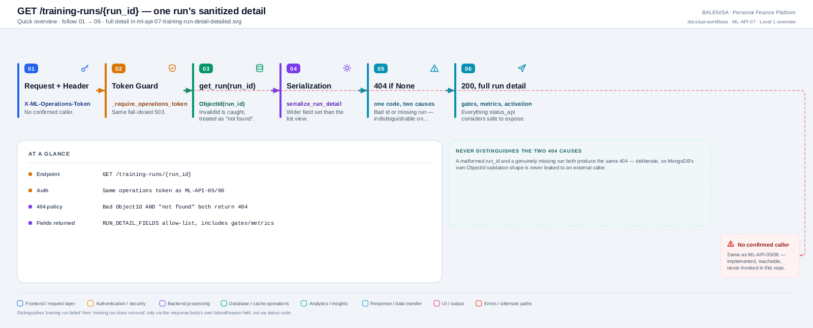
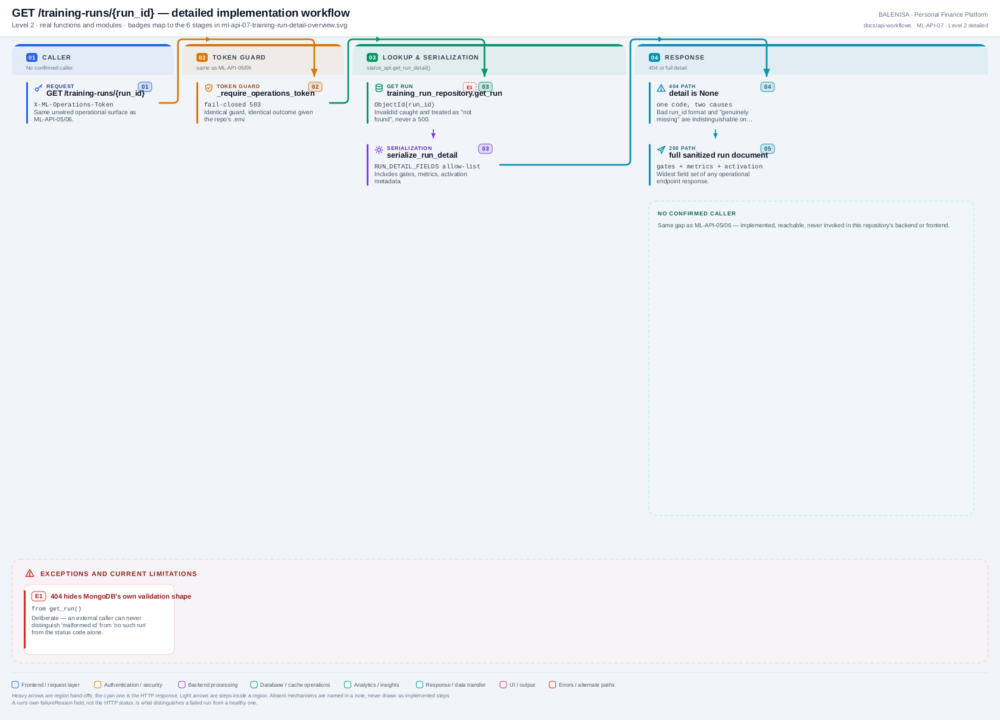

# ML-API-07 — GET /training-runs/{run_id}

Sanitized single-run detail view — one 404 for two distinct causes, by design.

---

## 1. Purpose

Lets an operator inspect one training run's full lifecycle detail: status, gates, metrics, activation metadata.

## 2. Endpoint and method

`GET /training-runs/{run_id}` — `app.py:482`, `@app.get("/training-runs/{run_id}")`.

## 3. Level 1 quick workflow

<picture>
  <source srcset="ml-api-07-training-run-detail-overview.svg" type="image/svg+xml">
  
</picture>

Vector: [`ml-api-07-training-run-detail-overview.svg`](ml-api-07-training-run-detail-overview.svg) ·
raster fallback: [`ml-api-07-training-run-detail-overview.png`](ml-api-07-training-run-detail-overview.png)

## 4. Level 2 detailed workflow

<picture>
  <source srcset="ml-api-07-training-run-detail-detailed.svg" type="image/svg+xml">
  
</picture>

Vector: [`ml-api-07-training-run-detail-detailed.svg`](ml-api-07-training-run-detail-detailed.svg) ·
raster fallback: [`ml-api-07-training-run-detail-detailed.png`](ml-api-07-training-run-detail-detailed.png)

## 5. Request schema and validation

Path param `run_id` (string, any format accepted at the route level — validity is checked downstream). Header: `X-ML-Operations-Token`.

## 6. Route/dependency order

| Layer | File | Function/class | Purpose |
|---|---|---|---|
| Route | `ml-service/app.py:482` | `training_run_detail()` | Token guard, then lookup |
| Guard | `ml-service/app.py:425` | `_require_operations_token()` | Same as ML-API-05/06 |
| Service | `ml-service/status_api.py:93` | `get_run_detail()` | Lookup + serialize |
| Repository | `ml-service/db/training_run_repository.py:212` | `get_run()` | `ObjectId(run_id)`, catches `InvalidId` |

## 7. Handler/service behaviour

```python
detail = status_api.get_run_detail(run_id)
if detail is None:
    raise HTTPException(status_code=404, detail="No such training run.")
return detail
```

`get_run()` treats a malformed `run_id` (not a valid MongoDB ObjectId) exactly the same as "no matching document" — both return `None`, both become the same 404 here.

## 8. Model/data dependencies

`mltrainingruns` MongoDB collection, read-only, one document.

## 9. Response schema

`RUN_DETAIL_FIELDS`: `runId, status, trigger, createdAt, startedAt, completedAt, heartbeatAt, failureReason, bookkeepingWarning, modelVersion, manifestGeneration, datasetHash, rowCounts, metrics, validation, activation`.

## 10. Confirmed caller

**None.**

## 11. Success path

Valid token + existing run → 200, full sanitized detail.

## 12. Failure paths and status codes

| Cause | Status |
|---|---|
| Token unset/wrong | 503 / 401 |
| Malformed `run_id` OR no matching run | 404 (indistinguishable) |

## 13. Concurrency behaviour

Read-only, single-document lookup; safe under any concurrency.

## 14. Security/privacy behaviour

Same fail-closed token guard. The 404 deliberately never reveals whether the id was malformed or simply absent — avoids leaking MongoDB's own ObjectId validation shape to an external caller.

## 15. Files involved

| Layer | File | Function/class | Purpose |
|---|---|---|---|
| Route + guard | `ml-service/app.py` | `training_run_detail()`, `_require_operations_token()` | Routing + access control |
| Service | `ml-service/status_api.py` | `get_run_detail()`, `serialize_run_detail()` | Lookup + response shaping |
| Repository | `ml-service/db/training_run_repository.py` | `get_run()` | Document fetch |

## 16. Current implementation observations

- Classified **Internal/testing endpoint** — same unconfigured/uncalled status as ML-API-05/06.
- Widest field set of the three operational endpoints — includes `activation` and `validation` gate detail not present in the list view (ML-API-06).
