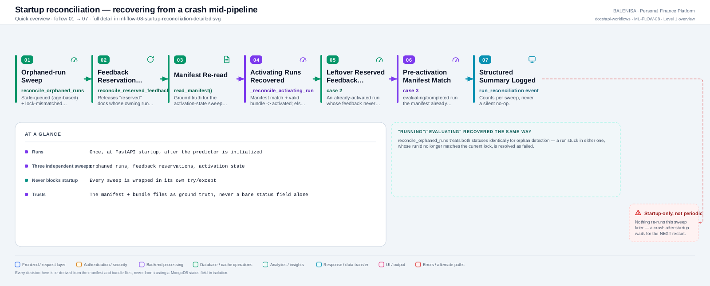
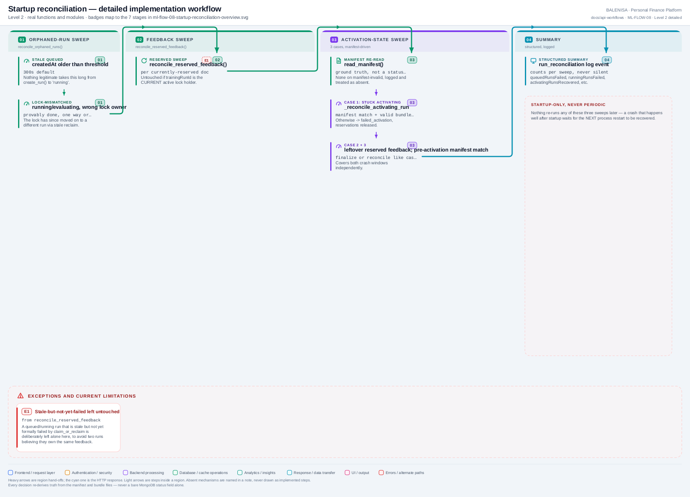

# ML-FLOW-08 — Training-run & feedback startup reconciliation

Three independent, best-effort sweeps run once at startup to recover from every confirmed crash window in the retraining lifecycle.

---

## 1. Purpose

Resolves training runs and feedback reservations left in an inconsistent state by a process that died mid-pipeline, using the manifest and bundle files as ground truth rather than trusting a bare MongoDB status field.

## 2. Level 1 quick workflow

<picture>
  <source srcset="ml-flow-08-startup-reconciliation-overview.svg" type="image/svg+xml">
  
</picture>

Vector: [`ml-flow-08-startup-reconciliation-overview.svg`](ml-flow-08-startup-reconciliation-overview.svg) ·
raster fallback: [`ml-flow-08-startup-reconciliation-overview.png`](ml-flow-08-startup-reconciliation-overview.png)

## 3. Level 2 detailed workflow

<picture>
  <source srcset="ml-flow-08-startup-reconciliation-detailed.svg" type="image/svg+xml">
  
</picture>

Vector: [`ml-flow-08-startup-reconciliation-detailed.svg`](ml-flow-08-startup-reconciliation-detailed.svg) ·
raster fallback: [`ml-flow-08-startup-reconciliation-detailed.png`](ml-flow-08-startup-reconciliation-detailed.png)

## 4. Trigger

FastAPI's `@app.on_event("startup")` handler `reconcile_training_runs_on_startup()`, registered last of the four startup handlers — after config validation, predictor initialization, and index creation.

## 5. Initial state

Whatever `mltrainingruns`/`mltraininglocks`/`mlfeedbacks` documents survived from before this process started, potentially left mid-transition by a prior crash.

## 6. Main components

| Layer | File | Function/class | Purpose |
|---|---|---|---|
| Orchestration | `app.py` | `reconcile_training_runs_on_startup()`, `_reconcile_activation_state()`, `_reconcile_activating_run()` | The three sweeps |
| Repository | `db/training_run_repository.py` | `reconcile_orphaned_runs()`, `find_runs_by_status()` | Run-side queries |
| Repository | `db/feedback_repository.py` | `reconcile_reserved_feedback()`, `finalize_trained_for_run()` | Feedback-side recovery |
| Manifest | `training/model_bundle.py` | `read_manifest()` | Ground truth for activation-state sweep |

## 7. Data/artifact movement

Reads `mltrainingruns`, `mltraininglocks`, `mlfeedbacks`, and `active.json`; writes status corrections back to the first and third.

## 8. State transitions

- **Sweep 1 (orphaned runs):** stale `queued` (age-based) → `failed`; lock-mismatched `running`/`evaluating` → `failed`.
- **Sweep 2 (feedback reservations):** `reserved` (orphaned) → `pending`.
- **Sweep 3 (activation state):** stuck `activating` → `activated` (if the manifest confirms it) or `failed_activation`; already-`activated` runs with leftover `reserved` feedback → finalized to `trained`; a manifest-referenced run still sitting at `evaluating`/`completed` → reconciled the same way as a stuck `activating` run.

## 9. Success path

All three sweeps run in order, each independently wrapped in its own `try/except`; a structured summary (`queuedRunsFailed`, `runningRunsFailed`, `activatingRunsRecovered`, `activatingRunsFailed`, `feedbackReturnedToPending`, `feedbackFinalizedToTrained`, `errors`) is assembled and logged as one `run_reconciliation` event.

## 10. Rejection/failure path

A failure in any one sweep is caught, logged as a warning, and appended to the summary's `errors` list — it never blocks the other sweeps or aborts startup. A single problem document within a sweep does not stop the rest of that sweep's documents from being processed.

## 11. Concurrency controls

None needed — this runs once, before the process accepts traffic, on a single thread, after the predictor is already initialized (ML-FLOW-02).

## 12. Persistence effects

Status corrections to `mltrainingruns` and `mlfeedbacks` documents; never touches bundle files or the manifest's contents (only reads the manifest).

## 13. Runtime/in-memory effects

Sweep 3's `activating`-run recovery can call `predictor_manager.preload_candidate()` + `swap_in()` if the manifest confirms this exact run is the one that should be live — meaning this flow *can* change this process's live snapshot, not just MongoDB state.

## 14. Recovery behaviour

This flow **is** the recovery mechanism for the other flows' own crash windows — see each of ML-FLOW-03 through ML-FLOW-07's "Recovery behaviour" sections, all of which point back here.

## 15. Backend/frontend impact

None directly, except insofar as sweep 3 can swap this process's live model before the first prediction request ever arrives.

## 16. Files involved

| Layer | File | Function/class | Purpose |
|---|---|---|---|
| Orchestration | `ml-service/app.py` | `reconcile_training_runs_on_startup()`, `_reconcile_activation_state()`, `_reconcile_activating_run()` | Full flow |
| Repository | `ml-service/db/training_run_repository.py` | `reconcile_orphaned_runs()`, `find_runs_by_status()` | Run queries |
| Repository | `ml-service/db/feedback_repository.py` | `reconcile_reserved_feedback()` | Feedback recovery |

## 17. Confirmed limitations

- **Startup-only, never periodic.** Nothing re-runs any of these three sweeps later in a running process's life — a crash that happens well after startup (not immediately followed by a restart) leaves its mess unresolved until the *next* restart.
- **Stale-but-not-yet-formally-failed runs are deliberately left untouched** by the feedback sweep, to avoid two runs believing they own the same feedback reservation — resolved only after the *next* retrain trigger's `claim_or_reclaim()` formally fails the stale run, and then only on the *following* reconciliation pass.
- **Trusts the manifest and bundle files over a bare status field**, by explicit design (Phase E spec) — every activation-state decision here re-verifies bundle completeness rather than assuming a MongoDB status is accurate.
