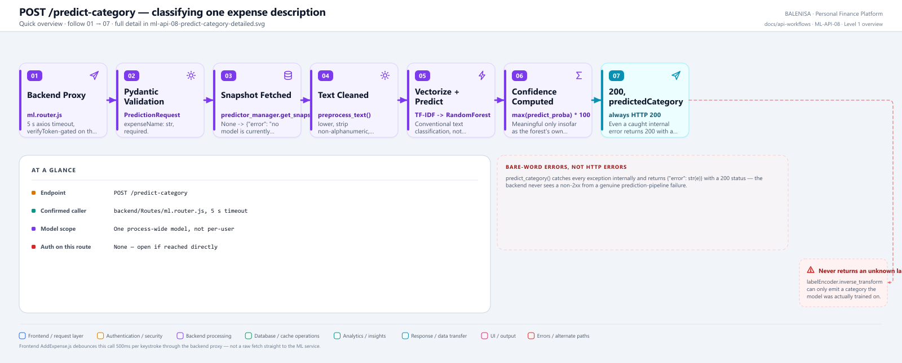
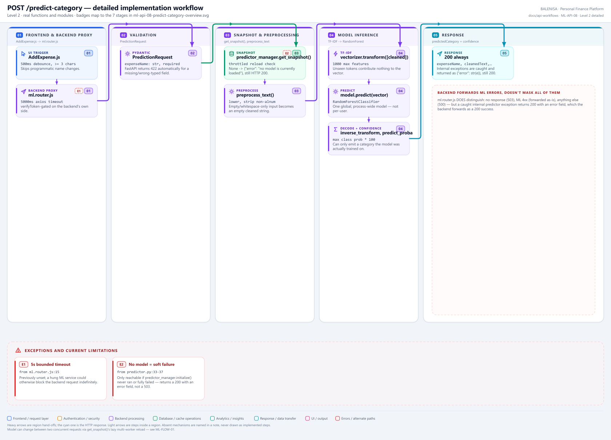

# ML-API-08 — POST /predict-category

Classifies one expense description into a category — the only endpoint the frontend indirectly drives, and the only workflow ML-FLOW-01 (the prediction pipeline) feeds.

---

## 1. Purpose

Returns a predicted expense category and confidence score for a raw text description, using whichever model is currently loaded in this process.

## 2. Endpoint and method

`POST /predict-category` — `app.py:519`, `@app.post("/predict-category")`.

## 3. Level 1 quick workflow

<picture>
  <source srcset="ml-api-08-predict-category-overview.svg" type="image/svg+xml">
  
</picture>

Vector: [`ml-api-08-predict-category-overview.svg`](ml-api-08-predict-category-overview.svg) ·
raster fallback: [`ml-api-08-predict-category-overview.png`](ml-api-08-predict-category-overview.png)

## 4. Level 2 detailed workflow

<picture>
  <source srcset="ml-api-08-predict-category-detailed.svg" type="image/svg+xml">
  
</picture>

Vector: [`ml-api-08-predict-category-detailed.svg`](ml-api-08-predict-category-detailed.svg) ·
raster fallback: [`ml-api-08-predict-category-detailed.png`](ml-api-08-predict-category-detailed.png)

## 5. Request schema and validation

```python
class PredictionRequest(BaseModel):
    expenseName: str
```

Pydantic enforces `expenseName` is present and a string (FastAPI returns 422 automatically otherwise). No length limit, no emptiness check, no non-string coercion guard beyond Pydantic's own type checking.

## 6. Route/dependency order

| Layer | File | Function/class | Purpose |
|---|---|---|---|
| Route | `ml-service/app.py:519` | `predict()` | Delegates directly to the predictor |
| Service | `ml-service/inference/predictor.py:26` | `predict_category()` | Full pipeline, catches all exceptions internally |
| Runtime | `ml-service/inference/predictor_manager.py` | `predictor_manager.get_snapshot()` | Snapshot acquisition (see ML-FLOW-01) |

## 7. Handler/service behaviour

```python
@app.post("/predict-category")
def predict(data: PredictionRequest):
    return predict_category(data.expenseName)
```

Full pipeline detailed in **ML-FLOW-01**. Every internal exception is caught inside `predict_category()` and returned as `{"error": str(e)}` — **with HTTP 200**, not a 5xx.

## 8. Model/data dependencies

One process-wide `RuntimeSnapshot` (model + vectorizer + label encoder), shared by every caller — not per-user. If no snapshot is loaded (`predictor_manager.initialize()` never ran or fully failed), returns `{"error": "no model is currently loaded"}`, still 200.

## 9. Response schema

Success: `{"expenseName": str, "cleanedText": str, "predictedCategory": str, "confidence": float}`.
Internal failure: `{"error": str}` — same 200 status.

## 10. Confirmed caller

**Yes** — `backend/Routes/ml.router.js`, `POST /ml/predict-category`, itself now a fully documented API workflow, **ML-API-11** (`verifyToken`-gated), which proxies to this endpoint with a 5000ms axios timeout. In turn called by `frontend/src/components/expensesHandling/AddExpense.js` via a 500ms-debounced `useEffect` on `expenseName` changes (skipping inputs under 3 characters and programmatic name changes).

## 11. Success path

Valid `expenseName` → snapshot acquired → text cleaned → TF-IDF transform → RandomForest predict → label decoded → confidence computed → 200 with the four-field response.

## 12. Failure paths and status codes

| Cause | This endpoint's response | Backend's forwarded response |
|---|---|---|
| No snapshot loaded | 200, `{"error": "no model is currently loaded"}` | Backend forwards the 200 body as-is (a success from the backend's perspective) |
| Any other internal exception | 200, `{"error": str(e)}` | Same — forwarded as 200 |
| ML service unreachable/timeout | N/A (never reached) | Backend: 503, `{"success": false, "message": "Prediction service unavailable"}` |
| ML service returns an ordinary 4xx | N/A (this endpoint has no validation-error branch beyond Pydantic 422) | Backend forwards status + body as-is |

## 13. Concurrency behaviour

`get_snapshot()`'s lazy multi-worker reload (see ML-FLOW-01) means the model can differ between two concurrent calls to this endpoint if a new candidate was just activated — never a torn read within a single call.

## 14. Security/privacy behaviour

This route requires `X-ML-Operations-Token`. The guard runs before inference, fails closed with `503` when `ML_OPERATIONS_TOKEN` is not configured, and returns `401` for a missing or invalid token. The Express proxy additionally requires the user's JWT via `verifyToken`.

## 15. Files involved

| Layer | File | Function/class | Purpose |
|---|---|---|---|
| Route | `ml-service/app.py` | `predict()` | Routing |
| Service | `ml-service/inference/predictor.py` | `predict_category()`, `preprocess_text()` | Pipeline |
| Runtime | `ml-service/inference/predictor_manager.py` | `predictor_manager` | Model state |
| Backend proxy | `backend/Routes/ml.router.js` | `POST /predict-category` | Auth + timeout + error translation |
| Frontend | `frontend/src/components/expensesHandling/AddExpense.js` | debounced `useEffect` | Trigger |

## 16. Current implementation observations

- **Internal errors return HTTP 200, not a 5xx.** The backend's three-way error branch (no-response → 503; ML 4xx → forwarded; else → 500) never triggers for a caught internal predictor exception, because `predict_category()` always returns 200. The backend forwards that 200 body verbatim, so a "no model loaded" condition looks like a successful prediction response containing an `error` field, not a service failure, to anything downstream that doesn't specifically check for the `error` key.
- Full prediction-pipeline detail, including determinism, concurrency, and category-set behaviour, is documented once in **ML-FLOW-01** rather than duplicated here.
