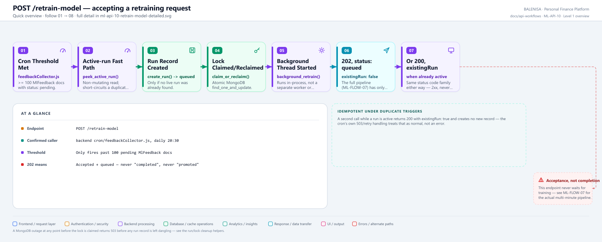
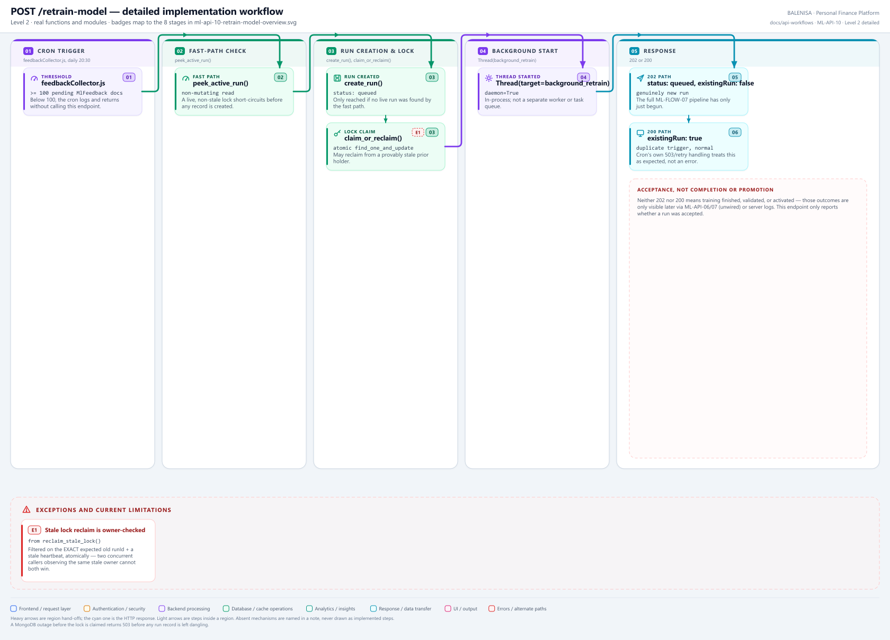

# ML-API-10 — POST /retrain-model

Accepts a retraining request — never waits for training, validation, or activation to complete.

---

## 1. Purpose

Starts (or reports an already-active) background retraining run, guarded by a MongoDB-backed distributed lock.

## 2. Endpoint and method

`POST /retrain-model` — `app.py:1089`, `@app.post("/retrain-model")`.

## 3. Level 1 quick workflow

<picture>
  <source srcset="ml-api-10-retrain-model-overview.svg" type="image/svg+xml">
  
</picture>

Vector: [`ml-api-10-retrain-model-overview.svg`](ml-api-10-retrain-model-overview.svg) ·
raster fallback: [`ml-api-10-retrain-model-overview.png`](ml-api-10-retrain-model-overview.png)

## 4. Level 2 detailed workflow

<picture>
  <source srcset="ml-api-10-retrain-model-detailed.svg" type="image/svg+xml">
  
</picture>

Vector: [`ml-api-10-retrain-model-detailed.svg`](ml-api-10-retrain-model-detailed.svg) ·
raster fallback: [`ml-api-10-retrain-model-detailed.png`](ml-api-10-retrain-model-detailed.png)

## 5. Request schema and validation

```python
class RetrainTriggerRequest(BaseModel):
    source: Optional[str] = None
```

Body is entirely optional (`payload: Optional[RetrainTriggerRequest] = None`). `source`, if given, is resolved against `ALLOWED_TRIGGER_SOURCES = {"cron", "manual", "api"}`; anything else (including the confirmed caller, which sends no body at all) falls back to `"api"`.

## 6. Route/dependency order

| Layer | File | Function/class | Purpose |
|---|---|---|---|
| Route | `ml-service/app.py:1089` | `retrain_model()` | Fast-path check, then run creation + lock claim |
| Repository | `ml-service/db/training_run_repository.py` | `peek_active_run()`, `create_run()`, `claim_or_reclaim()` | Lock/run bookkeeping |
| Background | `ml-service/app.py:864` | `background_retrain()` | Started as a daemon `Thread` (see ML-FLOW-07) |

## 7. Handler/service behaviour

1. `peek_active_run()` — cheap, non-mutating read; a live non-stale run short-circuits with no new record created.
2. `create_run()` — inserts a `queued` document, only if no live run was found.
3. `claim_or_reclaim()` — atomic MongoDB `find_one_and_update`; may reclaim from a provably stale prior holder (owner-checked, per Phase B.1).
4. `Thread(target=background_retrain, args=(run_id,), daemon=True).start()`.

Full detail of what happens after the thread starts is in **ML-FLOW-07**.

## 8. Model/data dependencies

`mltrainingruns` and `mltraininglocks` MongoDB collections. No model/artifact access at this stage — that begins inside the background thread.

## 9. Response schema

Accepted (new run): `{"success": true, "runId": str, "status": "queued", "existingRun": false, "message": "Retraining accepted"}`, **202**.
Already active: `{"success": true, "runId": str, "status": str, "existingRun": true, "message": "Retraining is already in progress"}`, **200**.

## 10. Confirmed caller

**Yes** — `backend/cron/feedbackCollector.js`, a `node-cron` job scheduled `"30 20 * * *"` (daily at 20:30 server time). Only fires when `MlFeedbackModel.countDocuments({status: "pending"}) >= 100`. No request body sent, no explicit timeout configured on this specific axios call.

## 11. Success path

No live run found → run created → lock claimed → background thread started → 202, `status: "queued"`.

## 12. Failure paths and status codes

| Cause | Status |
|---|---|
| MongoDB unreachable during `peek_active_run`, `create_run`, or `claim_or_reclaim` | 503, generic message (never leaks MongoDB credentials or a raw stack trace) |
| Lock genuinely held by a live run | 200, `existingRun: true` — **not an error** |
| Lost a genuine claim race to a concurrent caller | 200, `existingRun: true` — the losing run's bookkeeping document is deleted (`abandon_unclaimed_run`), never left as a misleading "failed" record |
| Thread construction/start itself fails | 503, and the run is marked failed + lock released before returning |

## 13. Concurrency behaviour

The MongoDB-backed lock (`mltraininglocks`, singleton document, atomic `find_one_and_update`) is what makes this safe across multiple worker processes/replicas — not just within one process. A stale lock (heartbeat older than `ML_RETRAIN_STALE_TIMEOUT_SECONDS`, default 1800s) can be reclaimed, but only from the exact previously-observed owner, atomically.

## 14. Security/privacy behaviour

This route requires `X-ML-Operations-Token` before it evaluates an active run, creates a run record, or claims a retraining lock. The backend cron sends that header through `mlOperationsHeaders()`; the endpoint fails closed with `503` if the service token is not configured and returns `401` for a missing or invalid token.

## 15. Files involved

| Layer | File | Function/class | Purpose |
|---|---|---|---|
| Route | `ml-service/app.py` | `retrain_model()`, `background_retrain()` | Routing + orchestration entry |
| Repository | `ml-service/db/training_run_repository.py` | `peek_active_run()`, `create_run()`, `claim_or_reclaim()` | Lock/run bookkeeping |
| Backend caller | `backend/cron/feedbackCollector.js` | node-cron job | Daily threshold-based trigger |

## 16. Current implementation observations

- **202/200 means accepted or already-active — never "completed" or "promoted."** The full pipeline (ML-FLOW-07) that follows can take minutes and can still fail at any of several later stages; this endpoint's response says nothing about that outcome.
- Retraining is not scheduled inside the ML service itself — it is entirely cron-in-the-Node-backend plus this manual/API path, never an ML-service-internal scheduler.
