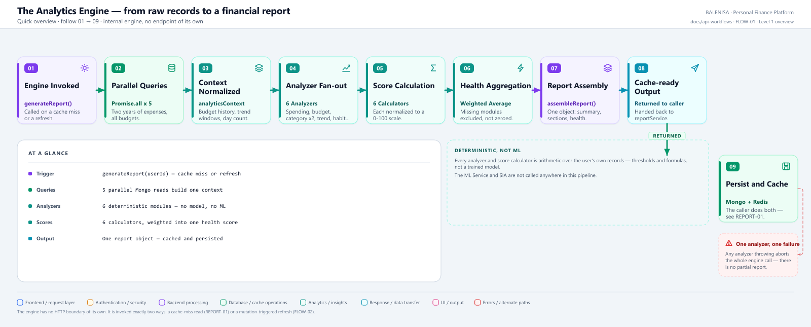
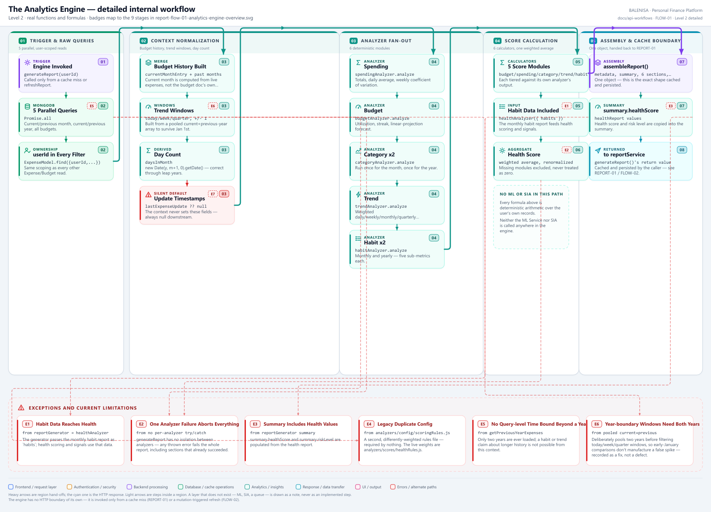

# FLOW-01 — The Analytics Engine

An internal computation flow, not an endpoint. **It has no HTTP boundary of its own** —
it is invoked exactly two ways: a true cache miss inside
[REPORT-01](../../get-report/report-consumption-map.md#a-report-api-inventory), or a mutation-triggered refresh
([FLOW-02](../mutation-refresh/report-flow-02-mutation-refresh.md)). Every statement below is traced to the
current repository implementation.

> **Deterministic, not ML.** Every analyzer and score calculator is arithmetic over the
> user's own records — thresholds, ratios, weighted averages. The ML Service and SIA are
> not called anywhere in this pipeline; their absence was confirmed by tracing every
> analyzer and score-calculator file, not assumed.

---

## 1. Purpose

Turns raw Expense/Budget records into the one report object cached in Redis and
persisted in Mongo. This is where every number in the Report actually comes from.

## 2. Classification

Using the module's classification list: **internal computation pipeline**, triggered
programmatically, no direct user action and no HTTP request/response of its own — it is
a function call inside a caller's request.

| Question | Answer |
|---|---|
| Does this have its own route? | **No** |
| Is it triggered by user action? | Indirectly — a page load (REPORT-01) or a mutation (FLOW-02) |
| Is it ML-based? | **No** — deterministic thresholds and formulas throughout |
| Does it call ML Service or SIA? | **No** — confirmed absent from every analyzer/score file |
| Can it run without any of the 6 analyzers? | No individually-disableable analyzers — the aggregation excludes a *missing* module's score but every analyzer always runs |
| Is it idempotent? | Yes for identical input data — no random or time-seeded values beyond the current-date boundary itself |

## 3. Level 1 — Quick workflow overview

<picture>
  <source srcset="report-flow-01-analytics-engine-overview.svg" type="image/svg+xml">
  
</picture>

Vector: [`report-flow-01-analytics-engine-overview.svg`](report-flow-01-analytics-engine-overview.svg) ·
raster fallback: [`report-flow-01-analytics-engine-overview.png`](report-flow-01-analytics-engine-overview.png)

## 4. Level 2 — Detailed workflow

<picture>
  <source srcset="report-flow-01-analytics-engine-detailed.svg" type="image/svg+xml">
  
</picture>

Vector: [`report-flow-01-analytics-engine-detailed.svg`](report-flow-01-analytics-engine-detailed.svg) ·
raster fallback: [`report-flow-01-analytics-engine-detailed.png`](report-flow-01-analytics-engine-detailed.png)

## 5. Trigger and input state

`generateReport(userId)`, exported from `analytics/reportGenerator.js`, called from
exactly two places: `reportService.getReport` (on a true double-miss) and
`reportService.refreshReport` (always, unconditionally). Input state is a `userId` — no
other parameter exists.

## 6. Raw data dependencies

Five parallel Mongo queries inside `createAnalyticsContext`, all `userId`-scoped:
current-month expenses, previous-month expenses, current-year expenses, previous-year
expenses, and all budgets. See the consumption map's [Table D](../../get-report/report-consumption-map.md#d-data-dependency-inventory)
for exact filters and ranges. No Income data is ever read.

## 7. Analytics Context schema

Built by `createAnalyticsContext`, consumed by every analyzer:

| Field | Type | Notes |
|---|---|---|
| `currentMonthExpenses` | array | |
| `previousMonthExpenses` | array | |
| `currentYearExpenses` | array | |
| `previousYearExpenses` | array | |
| `budgetHistory` | array | current month's `spent` is re-derived from live expenses, not read from the Budget document |
| `trendData` | object | today/yesterday/week/quarter windows, pooled across a year boundary before filtering |
| `daysInMonth` | number | |

`lastExpenseUpdate` / `lastBudgetUpdate` are **not** part of this schema — see Finding 3.

## 8. Analyzer orchestration

`generateReport` calls each analyzer in a fixed sequence, none awaited concurrently
(each is synchronous CPU work, not I/O):

1. `spendingAnalyzer.analyze(currentMonthExpenses)`
2. `budgetAnalyzer.analyze({history, spending: spendingReport, daysInMonth})`
3. `generateBudgetInsights(budgetReport)`
4. `categoryAnalyzer.analyze(currentMonthExpenses, previousMonthExpenses)` — monthly
5. `categoryAnalyzer.analyze(currentYearExpenses, previousYearExpenses)` — yearly
6. `trendAnalyzer.analyze({trendData, currentMonthExpenses, previousMonthExpenses})`
7. `habitAnalyzer.analyze(currentMonthExpenses)` — monthly
8. `habitAnalyzer.analyze(currentYearExpenses)` — yearly
9. `healthAnalyzer.analyze({budget, category, spending, trend, habits: monthlyHabitReport})`

## 9. Per-analyzer summary

| Analyzer | Key formulas / thresholds | Empty-data behaviour |
|---|---|---|
| Spending | totals excluding refunds from largest/smallest; daily average over tracking days; weekly coefficient-of-variation stability (needs ≥14 tracking days) | `{hasData: false}` on zero expenses |
| Budget | utilization %, status tiers (Safe ≤70 / Warning ≤90 / Critical ≤100 / Overspent), consecutive-month streak, linear day-elapsed projection | status still computed from a zero budget |
| Category | top/least category (reduce-based, undefined tie order), Herfindahl-style concentration index, top-N concentration, growth vs. prior period (`null` when prior = 0, `isNewCategory` flag) | empty totals object, no crash |
| Trend | daily/weekly/monthly/quarterly comparisons, weighted signal (`{daily:1, weekly:2, monthly:3, quarterly:4}`), direction (`Increasing >15% / Decreasing <-15% / Stable`) | `percentageChange: null` + `isNewSpending: true` instead of a fabricated 100%; `hasData:false` can still return populated sub-trends when all four show zero activity |
| Habit | weekend/weekday split (min sample 6, `null` not `0` for empty buckets), micro-spending (`qualifies` needs ≥5 txns, ≥₹300, ≥10% contribution), impulse spending (hardcoded categories, documented "Food" over-broad caveat), subscription and shopping-frequency patterns | sub-metrics individually null-guarded |
| Health | aggregates the other 5 into `{scores, overall, dataCompleteness, risk, signals}` | `INSUFFICIENT_DATA` sentinel when budget, trend and habits all show no data |

## 10. Score calculators

| Calculator | Range | Weight (`healthRules.js`) | Empty-data behaviour |
|---|---|---|---|
| `budgetScore` | 0–100 (`normalizedScore`) | 25 | `emptyResult(reason)` sentinel — `score: null` |
| `spendingScore` | 0–100 | 15 | `emptyResult` sentinel |
| `categoryScore` | 0–100 | 15 | `emptyResult` sentinel |
| `trendScore` | 0–100 | 15 | `emptyResult` sentinel; explicit `UNKNOWN_DIRECTION` fail-safe guard against analyzer/rules drift |
| `habitScore` | 0–100 | 20 | always computes a **non-null** deterministic score from an empty stub given Finding 1 — never legitimately empty, which is itself a symptom of the bug |
| `stabilityScore` (`healthScore.js`) | 0–100 | 10 | `null` + `INSUFFICIENT_DATA` when budget, trend and habits all show no data; a weekend-ratio "balanced" bonus can never fire given Finding 1 |

Weights sum to 100. `calculateHealthScore` filters to modules with a non-null
`normalizedScore` and computes a weighted average over **included** modules only —
a missing module is excluded from the denominator, never counted as zero.

## 11. Final aggregation

`calculateHealthScore(scores)` → `{overall, includedModules, excludedModules}`.
`calculateRiskLevel(overall)` → `{label, color, reason}`. `generateSignals({budget,
trend, habits, category})` produces human-readable flags — the habit-derived signals
(`MICRO_LOW/HIGH`, `IMPULSE_LOW/HIGH`, `SUBSCRIPTIONS_HIGH`) are effectively dead in
practice given Finding 1.

## 12. Report schema

`reportAssembler.assembleReport` returns the object documented in the consumption map's
[Table C](../../get-report/report-consumption-map.md#c-analytics-engine-component-inventory). This exact
shape is what gets cached, persisted, and returned to the frontend — the engine itself
never touches Redis or Mongo; that happens in the caller (REPORT-01 or FLOW-02).

## 13. Cache boundary

The engine has no cache awareness. `generateReport` always recomputes fully; caching
decisions belong entirely to `reportService`.

## 14. Failure behaviour

| Failure | Effect |
|---|---|
| Any analyzer throws | The whole `generateReport` call rejects — no partial report, no isolation between analyzers |
| A query in `Promise.all` fails | Same — the first rejection aborts context building entirely |
| Malformed expense date | `filterBetween` silently skips it (`Number.isNaN` guard) rather than crashing |

## 15. Performance characteristics

Five Mongo queries plus 6 analyzer passes plus 6 score calculations, all synchronous CPU
work after the queries resolve. Cost scales with the user's expense history size (two
years of data are loaded for year-over-year comparisons). No memoization or partial
recomputation exists — every trigger recomputes everything.

## 16. Confirmed limitations

- No ML/SIA dependency — deterministic engine only.
- No per-analyzer error isolation.
- No incremental/partial recompute.
- `lastExpenseUpdate` / `lastBudgetUpdate` always `null`.
- `financialHealth` has no frontend reader (see REPORT-01 §13).

## 17. Files involved

| Layer | File | Function/Export |
|---|---|---|
| Orchestrator | `backend/analytics/reportGenerator.js` | `generateReport` |
| Dead duplicate | `backend/analytics/generateReport.js` | `generateReport` (unused) |
| Context | `backend/analytics/analyticsContext.js` | `createAnalyticsContext` |
| Data | `backend/analytics/dataProvider.js` | 5 getters |
| Analyzers | `backend/analytics/analyzers/*.js` | `analyze` (x6) |
| Score calculators | `backend/analytics/analyzers/scoreCal/*.js` | `calculate*Score` (x6) |
| Rules | `backend/analytics/analyzers/scores/*.js` | tier/weight tables |
| Dead config | `backend/analytics/analyzers/config/scoringRules.js` | unused |
| Assembler | `backend/analytics/reportAssembler.js` | `assembleReport` |
| Insights | `backend/Services/BudgetServices/budgetInsight.service.js` | `generateBudgetInsights` |

---

## 18. Findings

**Summary:** Correctness 3 · Security / operational 1 · Reliability 2 · Maintainability 3

### Correctness

1. **Habit data reaches the health analyzer.** `reportGenerator.js` passes the monthly
   habit report as `habits`, which is the property consumed by `healthAnalyzer`, its
   habit score, stability calculation, and health signals.

2. **Summary health values are populated.** `reportGenerator.js` copies
   `healthReport.healthScore` and `healthReport.riskLevel` into the summary returned to
   the client.

3. **`lastExpenseUpdate` / `lastBudgetUpdate` are always null.** `reportGenerator.js`
   reads them off `analyticsContext` via `?? null`, but `createAnalyticsContext` never
   sets either field.

### Security / operational

4. **User-scoping is consistent.** Every one of the 5 queries filters by `userId`; no
   cross-account read path exists. (Recorded as a positive finding, not a defect.)

### Reliability

5. **No per-analyzer isolation.** A single analyzer throwing aborts the entire engine
   run — there is no partial report and no fallback to a previous good state beyond
   whatever REPORT-01's cache-first read already provides.

6. **No stampede protection.** Concurrent triggers for the same user (e.g. two rapid
   mutations) each run a full independent recompute.

### Maintainability

7. **A dead duplicate orchestrator (`generateReport.js`) and a dead duplicate rules
   config (`scoringRules.js`) both exist alongside their live counterparts,** with
   different — and in the config's case, incomplete — logic. Neither is required
   anywhere in the codebase (grep-confirmed).

8. **`OverallInsight.js` on the frontend computes its own, differently-formulated
   "Stability Score"** (`100 - coefficientOfVariation*100`, from `spending.stability`),
   which shares a label but not a formula with the backend's
   `financialHealth.scores.stability` — a naming collision across the boundary.

9. **`getexpense.service.js`'s `groupByMonth` appears unused by this pipeline** — a
   candidate dead-code helper, not confirmed unused repo-wide.
