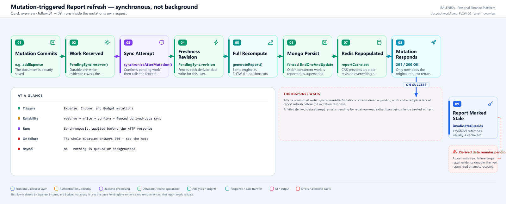
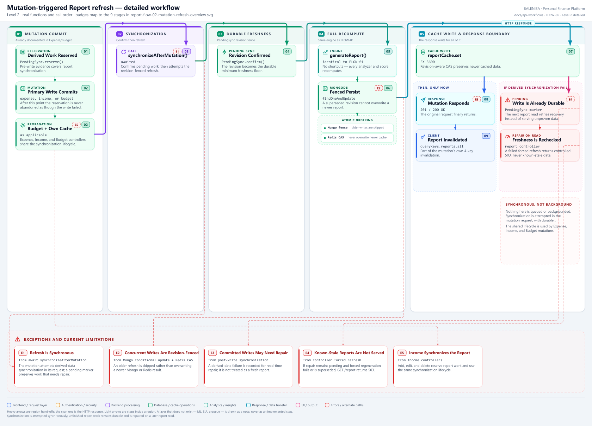

# FLOW-02 — Mutation-triggered Report refresh

A combined Expense/Budget → Report workflow. **Synchronous, not background — the
triggering mutation's own HTTP response waits for the entire Analytics Engine to
finish.** Every statement below is traced to the current repository implementation.

---

## 1. Purpose

Describes what happens between an Expense or Budget write and the cached/persisted
report reflecting it — the part no single endpoint fully owns, since the trigger lives
in six different mutation controllers.

## 2. Classification

Using the module's classification list: **type 6 — cross-module synchronous side
effect**, spanning Expense, Budget and Report. Not a type-4 frontend flow (no distinct
UI screen); not a type-2 upload flow.

| Question | Answer |
|---|---|
| Is the refresh awaited by the triggering request? | **Yes** |
| Is it queued or backgrounded? | **No** |
| Does the triggering mutation share a try/catch with the refresh? | **Yes**, in every caller |
| Can the refresh fail independently of the mutation succeeding? | **Yes** — Expense CRUD returns its committed success plus `derivedData.recoveryPending: true` |
| Does Income trigger this? | **Yes** — add, edit, and delete reserve report work and synchronize it |

## 3. Level 1 quick workflow

<picture>
  <source srcset="report-flow-02-mutation-refresh-overview.svg" type="image/svg+xml">
  
</picture>

Vector: [`report-flow-02-mutation-refresh-overview.svg`](report-flow-02-mutation-refresh-overview.svg) ·
raster fallback: [`report-flow-02-mutation-refresh-overview.png`](report-flow-02-mutation-refresh-overview.png)

## 4. Level 2 detailed workflow

<picture>
  <source srcset="report-flow-02-mutation-refresh-detailed.svg" type="image/svg+xml">
  
</picture>

Vector: [`report-flow-02-mutation-refresh-detailed.svg`](report-flow-02-mutation-refresh-detailed.svg) ·
raster fallback: [`report-flow-02-mutation-refresh-detailed.png`](report-flow-02-mutation-refresh-detailed.png)

## 5. Trigger and input state

Six call sites, grep-confirmed:

| Caller | File |
|---|---|
| Create expense | `Controllers/ExpenseControllers/addexpense.js` |
| Edit expense | `Controllers/ExpenseControllers/editExpense.js` |
| Delete expense | `Controllers/ExpenseControllers/deleteExpense.js` |
| Set budget | `Controllers/BudgetControllers/setbudget.js` |
| Update budget | `Controllers/BudgetControllers/updatebudget.js` |
| Recurring expense cron | `cron/recurringJob.js` |

Every mutation reserves report synchronization work **before its primary write**, then invokes
`synchronizeAfterMutation(...)` after the write. That service confirms durable pending evidence
and invokes the revision-fenced `refreshReport(userId, { fenceRevision })` attempt.
already committed**, and **before** sending its response.

## 6. Upstream and downstream API dependencies

| Step | Documented in |
|---|---|
| Triggering mutation | [Expense APIs](../../../expense/README.md), [Income APIs](../../../income/README.md), [Budget APIs](../../../budget/README.md) |
| The recompute itself | [FLOW-01 — the Analytics Engine](../analytics-engine/report-flow-01-analytics-engine.md) |
| The next read | [REPORT-01](../../get-report/report-consumption-map.md#a-report-api-inventory) — validates freshness before serving |

## 7. Data transformations

None specific to this flow — `refreshReport` calls the same `generateReport` documented
in FLOW-01 with no different input shape. The only transformation is the Redis
invalidate-then-repopulate sequence.

## 8. Refresh sequence

1. The triggering write commits (e.g. `newExpense.save()`).
2. The mutation's own propagation runs (e.g. `recalculateBudget`,
   `clearUserExpenseCache` for Expense) — documented in those modules, not here.
3. `synchronizeAfterMutation(...)` is called and **awaited**:
   1. `reportCache.invalidate(userId)` — Redis key deleted **first**, before recompute.
   2. `generateReport(userId)` — full engine run, identical to FLOW-01.
   3. `FinancialReport.findOneAndUpdate` conditionally persists only when its sync revision is not older,
      runValidators: true, setDefaultsOnInsert: true}).lean()`.
   4. `reportCache.set(userId, updatedReport)` — Redis repopulated, 1 h TTL.
4. Only after all of the above resolves does the triggering mutation send its own HTTP
   response.

## 9. Persistence boundary

The primary write and report persistence are independent Mongo operations, but the shared
`PendingSync` marker makes unfinished derived-data work durable. The primary write is durable by the time the refresh
even starts.

## 10. Failure and recovery behaviour

| Failure | Effect | Recovery |
|---|---|---|
| Expense CRUD derived-data synchronization cannot start or complete | The committed write still returns 2xx with `derivedData.recoveryPending: true` | The pre-write reservation or pending marker remains repairable; the next `GET /report` repairs it or returns controlled `503` rather than serving known-stale data |
| Redis down for `set` | Caught at the cache boundary | Mongo remains authoritative; a later read validates revision freshness |
| Two mutations for the same user race | Mongo revision fence and Redis CAS order writes | Older work is skipped rather than overwriting a newer report |

Expense create, edit, and delete never roll back a committed write because derived synchronization fails. Budget and Income mutation response semantics are outside this Expense-CUD scope.

## 11. Cache behaviour after the refresh

`reportCache` is invalidated then immediately repopulated — a request racing the
invalidate-to-set window sees a genuine Redis miss and falls through to Mongo, which may
itself be mid-upsert. Frontend-side, the triggering mutation's own `onSuccess` invalidates
`queryKeys.reports.all` among its other query families, so the next report read is a
fresh fetch — typically served instantly from the now-warm Redis cache.

## 12. Files involved

| Layer | File | Function/Export | Purpose |
|---|---|---|---|
| Trigger (example) | `backend/Controllers/ExpenseControllers/addexpense.js` | `addExpense` | Reserves report work, writes, then synchronizes derived data |
| Trigger (example) | `backend/Controllers/BudgetControllers/setbudget.js` | `setbudget` | Same shared lifecycle for a budget write |
| Trigger (example) | `backend/Controllers/IncomeControllers/addincome.js` | `addIncome` | Reserves and synchronizes report work |
| Refresh entrypoint | `backend/Services/syncRecoveryService.js` | `synchronizeAfterMutation` | Confirm pending work → fenced recompute → revision-aware cache write |
| Engine | `backend/analytics/reportGenerator.js` | `generateReport` | Documented in FLOW-01 |
| Cache | `backend/cache/reportCache.js` | `getWithRevision`, `set` | `report:<userId>`, TTL 3600 s, Redis CAS write |
| Model | `backend/models/Report.js` | `FinancialReport` | Persisted with a revision fence |

---

## 13. Findings

**Summary:** Correctness 1 · Security / operational 0 · Reliability 3 · Maintainability 1

### Correctness

1. **Income triggers this flow.** Add, edit, and delete Income controllers reserve report
   work and use `synchronizeAfterMutation`, even though the current analytics data provider
   does not read `IncomeModel`.

### Reliability

2. **The triggering mutation's response blocks on the full Analytics Engine.** Every
   Expense/Budget write pays the entire engine's cost — 5 queries, 6 analyzers, 6 score
   calculators — inside its own request, with no async or background path.

3. **Expense CRUD false-failure response was fixed.** `synchronizeAfterMutation` now converts unexpected post-commit errors into a pending derived-data result, so expense create, edit, and delete remain successful while recovery continues on the next protected read.

4. **No stampede protection.** Concurrent mutations for the same user each independently
   invalidate, recompute and overwrite Mongo/Redis — last write wins, with no lock or
   coalescing.

### Maintainability

5. **The refresh logic is duplicated by reference across six call sites** rather than
   centralized in shared mutation middleware — a future seventh mutation type must
   remember to call `refreshReport` itself; nothing enforces it structurally.
