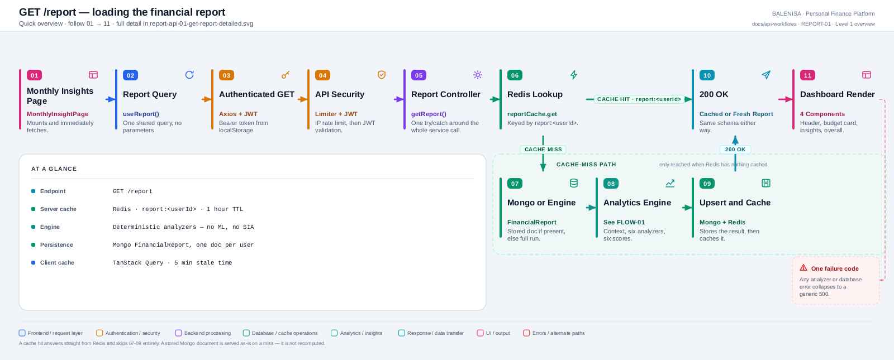
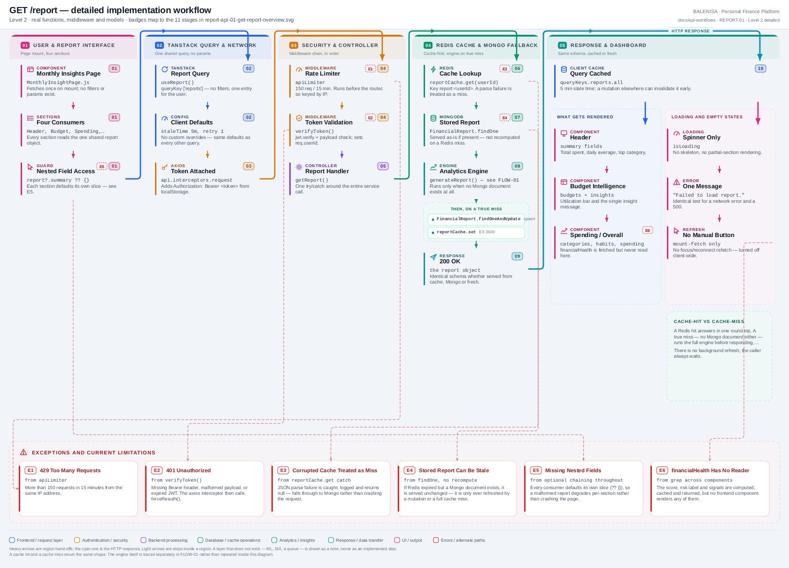

# REPORT-01 — Get the financial report

`GET /report`

Two levels of the same workflow. Every statement below is traced to the current
repository implementation.

> **Cache-first, not always-fresh.** A Redis hit returns instantly. A Redis miss with an
> existing Mongo document returns that document **as-is** — it is not recomputed. Only a
> true miss (neither cache nor stored document) runs the full Analytics Engine inline.

---

## 1. Purpose

Returns the current user's financial report: spending, budget, category, trend, habit
and (nominally) health analysis, plus a top-level `summary`. This is the sole read
surface for everything the Analytics Engine produces.

## 2. Route and method

| | |
|---|---|
| **Method** | `GET` |
| **Path** | `/report` |
| **Mount** | `app.use("/report", apiLimiter, reportRoutes)` — `backend/server.js` |
| **Middleware** | `apiLimiter` → `verifyToken` → `reportController.getReport` |
| **Auth** | Required — Bearer JWT |
| **Body/params** | None — no filters, no date range, no pagination |
| **Server cache** | Redis, `report:<userId>`, TTL 3600 s |

`report.routes.js` declares exactly one route. There is no way to request a partial
report, a historical report, or a report for a different date range through this API.

## 3. Level 1 — Quick workflow overview

<picture>
  <source srcset="report-api-01-get-report-overview.svg" type="image/svg+xml">
  
</picture>

Vector source: [`report-api-01-get-report-overview.svg`](report-api-01-get-report-overview.svg) ·
raster preview / fallback: [`report-api-01-get-report-overview.png`](report-api-01-get-report-overview.png)

## 4. Level 2 — Detailed implementation workflow

<picture>
  <source srcset="report-api-01-get-report-detailed.svg" type="image/svg+xml">
  
</picture>

Vector source: [`report-api-01-get-report-detailed.svg`](report-api-01-get-report-detailed.svg) ·
raster preview / fallback: [`report-api-01-get-report-detailed.png`](report-api-01-get-report-detailed.png)

> Zoomable engineering reference. Use the Level 1 overview for the shape of the flow.

## 5. Frontend initiator and consumer

**Initiator.** `MonthlyInsightPage.js`, via `useReport()`. The query fires on mount with
no parameters — there is nothing for the user to configure before the request goes out.

**Consumer.** Four sections read disjoint slices of the same object: `Header.js`
(`summary`), `BudgetIntelligence.js` (`budgets`), `SpendingInsights.js` (`categories`,
`habits`), `OverallInsight.js` (`categories`, `budgets`, `spending`). Every consumer
defaults its own slice with `?? {}`, so a malformed or partial report degrades
per-section rather than crashing the page.

## 6. Execution sequence

1. `apiLimiter` → `verifyToken` → `reportController.getReport`.
2. `reportService.getReport(userId)`:
   1. `reportCache.get(userId)` — Redis lookup on `report:<userId>`. **Hit** → return
      immediately, skip everything below.
   2. **Miss** → `FinancialReport.findOne({user: userId}).lean()`. **Found** → cache it
      in Redis and return it **as stored**, with no recomputation.
   3. **Not found either** → `generateReport(userId)` (the full Analytics Engine —
      documented separately in [FLOW-01](report-flow-01-analytics-engine.md)).
   4. `FinancialReport.findOneAndUpdate({user: userId}, {...generated}, {upsert: true,
      runValidators: true, setDefaultsOnInsert: true}).lean()`.
   5. `reportCache.set(userId, savedReport)` — Redis write, 1 h TTL.
3. `res.status(200).json(report)` — identical response shape for all three paths.

## 7. Cache behaviour

| Cache | Behaviour on this route |
|---|---|
| Redis (`report:<userId>`, TTL 3600 s) | Read first; written on every miss (both the Mongo-hit and the full-engine paths) |
| Mongo `FinancialReport` | Read on a Redis miss; **served as-is if present, never recomputed here** — recomputation only happens via `refreshReport` (a different code path, see FLOW-02) or a true double-miss |
| TanStack Query (`reports.all`) | Populated by this response; invalidated elsewhere by Expense/Budget (and, harmlessly, Income) mutations |

A stale Mongo document (expired from Redis but never refreshed) is therefore served
unchanged by this endpoint until something else triggers a refresh.

## 8. Database operations

At most two reads and, on a true miss, one additional upsert:

1. `FinancialReport.findOne({user: userId}).lean()` — conditional on a Redis miss.
2. `generateReport(userId)`'s own 5 parallel queries — conditional on both caches missing
   (see [FLOW-01 §7](report-flow-01-analytics-engine.md) for the full list).
3. `FinancialReport.findOneAndUpdate(... upsert: true)` — conditional on step 2 running.

No transaction wraps any of this. All of it runs inside the single request.

## 9. Success response

```jsonc
{
  "metadata": { "version": 1, "generatedAt": "...", "reportPeriod": {...},
                "lastExpenseUpdate": null, "lastBudgetUpdate": null },
  "summary": { "totalSpent": 0, "transactionCount": 0, "dailyAverage": 0,
               "comparePastMonth": null, "topCategory": "N/A",
               "budgetUtilization": 0, "budgetStatus": "...",
               "healthScore": undefined, "riskLevel": undefined },
  "spending": {...}, "budgets": {...},
  "categories": { "monthly": {...}, "yearly": {...} },
  "trends": {...}, "habits": { "monthly": {...}, "yearly": {...} },
  "financialHealth": { "scores": {...}, "overall": 62.4,
                        "risk": { "label": "Moderate", "color": "yellow" },
                        "dataCompleteness": {...}, "signals": [...] },
  "forecast": {}
}
```

`summary.healthScore` and `summary.riskLevel` are always `undefined` — see
[FLOW-01 §13, F2](report-flow-01-analytics-engine.md). The real values live at
`financialHealth.overall` and `financialHealth.risk`, and no frontend component reads
either path (see the consumption map, Table B).

## 10. Error behaviour

| Tag | Condition | Where | Result |
|---|---|---|---|
| E1 | > 150 req / 15 min | `apiLimiter` | `429` |
| E2 | Missing/malformed/expired JWT | `verifyToken` | `401` |
| E3 | Corrupted cached JSON | `reportCache.get`'s try/catch | Treated as a miss, falls through to Mongo — no crash |
| E4 | Any analyzer, database, or cache write failure | controller `catch` | generic `500 {success:false, message:"Failed to fetch financial report."}`, logged via `console.error("Report Error:", error)` |

There is one failure code for every backend error — the client cannot distinguish a
Redis outage from an analyzer exception from a Mongo write failure.

## 11. Cross-module effects

- **Expense/Budget.** Neither is written by this route. Both are read-only inputs when
  the engine runs.
- **Charts.** No relationship — Charts reads its own aggregation queries independently.
- **Income.** Never read by the engine (confirmed absent from `dataProvider.js`), despite
  the frontend invalidating `reports.all` on every income mutation.
- **ML Service / SIA.** Not called anywhere in this request.

## 12. File map

| Layer | File | Function / export | Purpose |
|---|---|---|---|
| Initiator | `frontend/src/components/monthlyInsights/MonthlyInsightPage.js` | `MonthlyInsightPage` | Mounts, renders 4 sections from one query |
| Hook | `frontend/src/hooks/useReport.js` | `useReport` | `useQuery`, no custom overrides |
| API client | `frontend/src/api/reportApi.js` | `getReport` | `GET /report` |
| Route | `backend/Routes/report.routes.js` | `router.get("/", ...)` | `verifyToken` → `getReport` |
| Controller | `backend/Controllers/report.controller.js` | `getReport` | One try/catch, delegates to the service |
| Service | `backend/Services/reportService.js` | `getReport`, `refreshReport` | Cache-first read; refresh is a separate exported function used by FLOW-02 |
| Engine orchestrator | `backend/analytics/reportGenerator.js` | `generateReport` | Documented in FLOW-01 |
| Cache | `backend/cache/reportCache.js` | `get`, `set`, `invalidate` | `report:<userId>`, TTL 3600 s |
| Model | `backend/models/Report.js` | `FinancialReport` | One document per user, Mixed-typed sections |

---

## 13. Findings

**Summary:** Correctness 2 · Security / operational 1 · Reliability 3 · Maintainability 2

### Correctness

1. **`summary.healthScore` and `summary.riskLevel` are always `undefined`.**
   `reportGenerator.js` reads `healthReport.healthScore` / `healthReport.riskLevel`, but
   `healthAnalyzer.analyze` returns `{scores, overall, dataCompleteness, risk, signals}` —
   neither field exists. Verified by executing the generator against real data.
   **Consequence:** the two summary fields are dead weight in every report ever produced.

2. **A stale Mongo-backed report can be served indefinitely.** If Redis expires and no
   mutation has triggered a refresh since, `getReport` returns the stored document
   unchanged — there is no age check against `metadata.generatedAt`.

### Security / operational

3. **One error code for every failure mode.** A Redis outage, a Mongo failure and an
   analyzer exception all surface as the same generic 500, which makes client-side and
   log-based triage harder than it needs to be.

### Reliability

4. **A true cache miss pays the full engine cost inline.** `generateReport` runs 5
   parallel Mongo queries plus 6 analyzers plus 6 score calculators inside this request —
   there is no background computation or stale-while-revalidate pattern.

5. **No cache-stampede protection.** Two concurrent true-miss requests for the same user
   each run the full engine and each upsert independently; the second write simply wins.

6. **No transaction around the Mongo upsert and the Redis write.** A crash between them
   leaves Mongo updated but Redis still empty (or vice versa on the next read) — a benign
   but real inconsistency window.

### Maintainability

7. **A dead duplicate orchestrator exists.** `analytics/generateReport.js` is never
   required anywhere (grep-confirmed) but sits alongside the real
   `analytics/reportGenerator.js` with a different, also-buggy `healthAnalyzer` call
   commented out inside it — a maintenance trap for anyone searching by function name.

8. **The entire `financialHealth` object has no frontend reader.** It is computed by 6
   analyzers, aggregated by a 6th, cached in Redis and persisted in Mongo — and never
   rendered (confirmed by grep across `frontend/src/components/`). This is documented
   further in [FLOW-01 §13](report-flow-01-analytics-engine.md).
