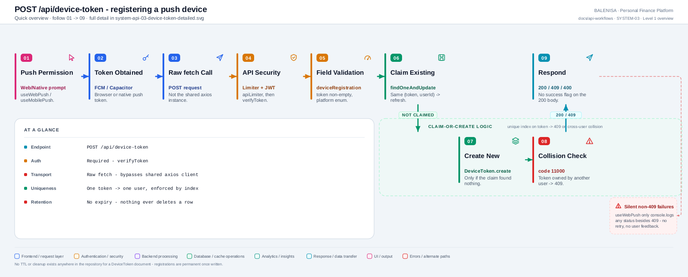
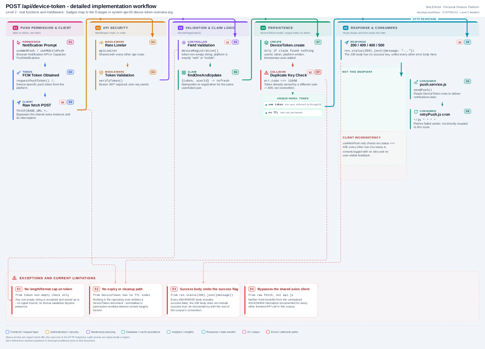

# SYSTEM-03 — Register a push-notification device token

`POST /api/device-token`

Discovered during the repository-wide API coverage gate. Had zero references anywhere in
`docs/api-workflows/` prior to this document, despite being real, mounted, authenticated,
and called from two frontend hooks. Mounted on the same `api.routes.js` router as the
Budget module's endpoints, but is not a budget concern — it registers a device for push
notifications (a feature otherwise undocumented across this corpus; the sending side,
`backend/cron/retryPush.js` and `backend/Services/push.service.js`, is internal-only and
carries no HTTP endpoint of its own).

## 1. Purpose

Lets an authenticated client register (or re-claim) a Firebase Cloud Messaging device
token so the backend's push-notification pipeline (`push.service.js`, driven by
`recurringJob.js` and retried by `retryPush.js`) can target that device.

## 2. Endpoint and HTTP method

| | |
|---|---|
| **Method** | `POST` |
| **Path** | `/api/device-token` |
| **Mount** | `app.use("/api", apiLimiter, apiRouter)` (`server.js:88`) → `router.post('/device-token', verifyToken, deviceRegistration)` (`api.routes.js`) |
| **Middleware order** | `apiLimiter` → `verifyToken` → `deviceRegistration` |
| **Auth** | Required — Bearer JWT |
| **Rate limiting** | `apiLimiter`, shared with every other `/api` route |
| **Server cache** | None |

## 3. Level 1 quick workflow

<picture>
  <source srcset="system-api-03-device-token-overview.svg" type="image/svg+xml">
  
</picture>

Vector: [`system-api-03-device-token-overview.svg`](system-api-03-device-token-overview.svg) ·
raster fallback: [`system-api-03-device-token-overview.png`](system-api-03-device-token-overview.png)

## 4. Level 2 detailed workflow

<picture>
  <source srcset="system-api-03-device-token-detailed.svg" type="image/svg+xml">
  
</picture>

Vector: [`system-api-03-device-token-detailed.svg`](system-api-03-device-token-detailed.svg) ·
raster fallback: [`system-api-03-device-token-detailed.png`](system-api-03-device-token-detailed.png)

## 5. Request structure

```http
POST /api/device-token HTTP/1.1
Authorization: Bearer <jwt>
Content-Type: application/json

{ "token": "<fcm-device-token>", "platform": "web" }
```

`platform` is `"web"` or `"mobile"` only — there is no third value, and the client-side
`web`/`mobile` split is enforced at the hook level (`useWebPush.js` always sends `"web"`,
`useMobilePush.js` always sends `"mobile"`), not derived from a header.

## 6. Request validation behaviour

| Check | Where | On failure |
|---|---|---|
| `token` present, non-empty string | `deviceRegistration.js:11-13` | `400 "Device token is required"` |
| `platform` is exactly `"web"` or `"mobile"` | `deviceRegistration.js:15-17` | `400 "Platform must be 'web' or 'mobile'"` |
| JWT valid | `verifyToken` (Authentication module) | `401`, before the controller runs |

No length cap on `token`, no format check beyond non-empty — an arbitrary string is
accepted and stored as-is.

## 7. Processing behaviour

1. `DeviceToken.findOneAndUpdate({ token, userId }, { userId, platform }, { new: true })`
   — if this exact `(token, userId)` pair already exists, it is refreshed in place
   (idempotent re-registration for the same user).
2. If no document was updated (`claimed` is falsy — either the token doesn't exist yet, or
   it exists under a **different** `userId`), `DeviceToken.create({ token, userId,
   platform })` is attempted.
3. The `DeviceToken` schema's `token` field is `unique: true` at the MongoDB index level.
   If step 2's `create` collides with a token already owned by another user, MongoDB
   raises a duplicate-key error (`code === 11000`), which the controller catches
   specifically and turns into a `409`. Any other error from `create` is re-thrown to the
   outer `catch` as a `500`.

This means: the **same physical device token cannot be registered to two different user
accounts at once** — a shared or reused device (e.g., a second user logging in on the same
browser/app install after the first) is rejected with `409`, not silently reassigned.

## 8. Response structure

| Outcome | Status | Body |
|---|---|---|
| Refreshed existing registration | `200` | `{ "message": "Device registered successfully" }` |
| Created new registration | `200` | `{ "message": "Device registered successfully" }` |
| Token already owned by another user | `409` | `{ "message": "Device token already registered to another account", "success": false }` |
| Validation failure | `400` | `{ "message": "...", "success": false }` |
| Unexpected error | `500` | `{ "message": "Internal Server Error", "success": false }` |

Note: the `200` success body has no `"success": true` key, unlike the `400`/`409`/`500`
bodies, which all include `"success": false` — an inconsistency with the `success`-flag
convention used by every other documented endpoint in this corpus.

## 9. Persistence behaviour

Writes to the `DeviceToken` collection (`backend/models/DeviceToken.js`): `userId`
(`ObjectId`, ref `users`), `token` (`String`, unique), `platform` (`enum: ["web",
"mobile"]`), plus Mongoose `timestamps`. No expiry, no TTL index — a token is retained
indefinitely once written, including after the user logs out or uninstalls the app;
nothing in this codebase deletes a `DeviceToken` document.

## 10. Frontend consumption

Two call sites, both using the raw `fetch` API directly against
`${REACT_APP_BACKEND_URL}/api/device-token` — **not** through the shared `api` axios
instance (`frontend/src/api/axios.js`) that every other documented endpoint in this corpus
uses:

- `frontend/src/components/hooks/useWebPush.js` — `registerToken()`, called when
  `Notification.permission === "granted"` on login, or after the user accepts an in-app
  prompt shown 5 seconds after login if permission is `"default"`. Sends `platform: "web"`.
- `frontend/src/components/hooks/useMobilePush.js` — inside the Capacitor
  `PushNotifications` `"registration"` listener, fired after native permission is granted
  and `PushNotifications.register()` resolves. Sends `platform: "mobile"`.

Because both bypass the shared axios instance, neither benefits from its response
interceptor (centralized 401/429/409 handling documented for every other endpoint) — each
hook checks `res.status === 409` manually and logs a warning; every other non-2xx status
is only `console.log`-ed (web) or silently dropped (mobile), with no user-facing feedback
either way.

## 11. TanStack Query and cache behaviour

Not applicable. Neither hook uses TanStack Query — both are plain `fetch` calls inside a
`useEffect`/`useCallback`, with no mutation object, no cache entry, and no invalidation.

## 12. Loading, success and error states

No loading state is surfaced to the UI in either hook — registration happens silently in
the background. `useWebPush` shows an "enable notifications" prompt (`showNotificationPrompt`)
before the call, but nothing reflects the call's outcome back into the UI; a failed
registration and a successful one look identical to the user.

## 13. Runtime/in-memory effects

None on the backend beyond the DB write. On the client, `useWebPush`'s
`showNotificationPrompt` boolean is local React state, reset only by explicit
enable/later actions, not by the registration outcome.

## 14. Security and operational behaviour

| Concern | Finding |
|---|---|
| Auth | Required — correct, `verifyToken` runs before the controller |
| Cross-user protection | Present — the unique index plus the explicit `11000` handling prevents one user's token silently overwriting another's ownership |
| Rate limiting | `apiLimiter`, shared and IP/user-keyed like the rest of `/api` |
| Token format | Untrusted, unvalidated string beyond non-empty — stored as-is |
| Retention | No expiry or cleanup — stale/uninstalled-app tokens accumulate forever; `retryPush.js`/`push.service.js` will keep attempting delivery to dead tokens indefinitely (any FCM-side "token no longer valid" signal is not consumed anywhere in this codebase) |
| Transport | `fetch`, not the shared axios client — bypasses the app's centralized error/interceptor handling, a maintainability and consistency gap rather than a security one |

## 15. Files involved

| Layer | File | Function/Export | Purpose |
|---|---|---|---|
| Frontend | `frontend/src/components/hooks/useWebPush.js` | `registerToken`, `useWebPush` | Web push registration |
| Frontend | `frontend/src/components/hooks/useMobilePush.js` | `useNativePush` | Native/mobile push registration |
| Server mount | `backend/server.js` | `app.use("/api", apiLimiter, apiRouter)` | Rate limiter ahead of the router |
| Route | `backend/Routes/api.routes.js` | `router.post('/device-token', verifyToken, deviceRegistration)` | Route wiring |
| Auth | `backend/Middlewares/Auth.js` | `verifyToken` | JWT check |
| Controller | `backend/Controllers/PushNotifications/deviceRegistration.js` | `deviceRegistration` | Validation, claim/create logic |
| Model | `backend/models/DeviceToken.js` | `DeviceToken` (Mongoose model) | Schema, unique index on `token` |
| Consumer (not this endpoint) | `backend/Services/push.service.js` | `sendPush` | Reads `DeviceToken` documents to deliver notifications |
| Consumer (not this endpoint) | `backend/cron/retryPush.js` | node-cron, `*/15 * * * *` | Retries failed pushes via `Notification` records, not directly coupled to this endpoint |

## 16. Current implementation observations

**Summary:** Correctness 1 · Security / operational 2 · Reliability 2 · Maintainability 2

### Correctness

1. **The success response omits the `success` key** that every other endpoint's success
   body in this corpus includes. A frontend branch checking `res.success === true` (the
   pattern used elsewhere) would not work against this endpoint's `200` body — the two
   current callers avoid this only because they check `res.status`, not the body.

### Security / operational

2. **No token expiry or invalidation path.** Confirmed by inspection of the `DeviceToken`
   schema and every file that reads it (`push.service.js`): there is no TTL index, no
   "last seen" field, and no code path anywhere in the repository that deletes a
   `DeviceToken` document. A user who uninstalls the app or revokes notification
   permission leaves a permanent row that `push.service.js` will keep targeting.

### Reliability

3. **Bypasses the shared axios client and its interceptors.** Both callers use raw
   `fetch`, so the centralized 401-refresh/429/409 handling documented for every other
   frontend API call (`frontend/src/api/axios.js`) does not apply here — confirmed neither
   hook imports `api` from `axios.js`.

4. **Non-409 failures are effectively silent.** `useWebPush` only logs
   `console.log("Backend response:", res.status)` for any non-409 status, including 400,
   401, and 500 — there is no retry and no user-visible indication that push registration
   failed.

### Maintainability

5. **The device-registration feature has no documentation footprint anywhere else in the
   codebase's own docs.** It shares a router file with Budget but is unrelated to it, has
   its own model, its own two frontend hooks, and its own downstream consumer
   (`push.service.js`) — a structurally distinct feature that had no module of its own
   prior to this coverage-gate document.

6. **The sending side is out of scope for this endpoint doc.** `push.service.js` and
   `retryPush.js` consume `DeviceToken` but expose no HTTP surface — they are internal-only
   and are referenced here only to complete the persistence-consumer trace, per the same
   convention used for the ML Service audit's non-API internal flows.
