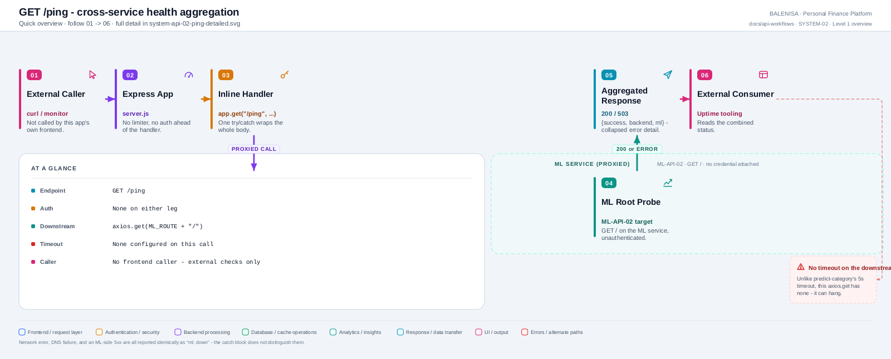
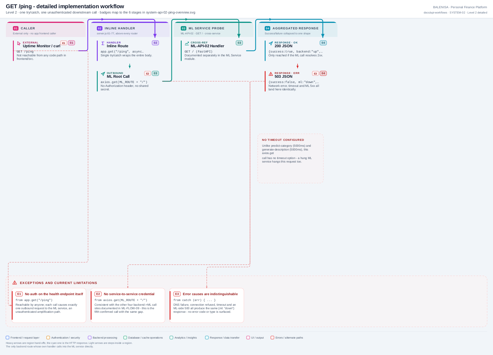

# SYSTEM-02 — Cross-service health ping

`GET /ping`

Discovered during the repository-wide API coverage gate. Defined directly on the Express
`app` object in `backend/server.js`, immediately after `GET /`. This is the **only**
backend route whose handler itself calls into the ML service — every other backend→ML
call (predict, describe, retrain) is triggered by a controller reached through a
different route, not by this one.

## 1. Purpose

Reports whether both the backend process and the ML service are reachable, in one round
trip, by proxying a single call to the ML service's own root (`ML-API-02`, `GET /`).

## 2. Endpoint and HTTP method

| | |
|---|---|
| **Method** | `GET` |
| **Path** | `/ping` |
| **Mount** | `app.get("/ping", ...)` — `backend/server.js:61-77`, above every router mount |
| **Middleware order** | `cors()` → `express.json()` → handler. No `apiLimiter`, no `verifyToken` |
| **Auth** | None |
| **Rate limiting** | None |
| **Downstream call** | `axios.get(`${process.env.ML_ROUTE}/`)` — no explicit timeout configured on this call |

## 3. Level 1 quick workflow

<picture>
  <source srcset="system-api-02-ping-overview.svg" type="image/svg+xml">
  
</picture>

Vector: [`system-api-02-ping-overview.svg`](system-api-02-ping-overview.svg) ·
raster fallback: [`system-api-02-ping-overview.png`](system-api-02-ping-overview.png)

## 4. Level 2 detailed workflow

<picture>
  <source srcset="system-api-02-ping-detailed.svg" type="image/svg+xml">
  
</picture>

Vector: [`system-api-02-ping-detailed.svg`](system-api-02-ping-detailed.svg) ·
raster fallback: [`system-api-02-ping-detailed.png`](system-api-02-ping-detailed.png)

## 5. Request structure

```http
GET /ping HTTP/1.1
Host: <backend-host>
```

No headers, body, query string or path parameters are read.

## 6. Request validation behaviour

None — no input to validate.

## 7. Processing behaviour

One `await axios.get(`${process.env.ML_ROUTE}/`)` call, wrapped in a single `try/catch`
covering the entire body. This is ML-API-02 on the ML-service side (`GET /`, the FastAPI
root). **No service-to-service credential is attached** — consistent with the other three
backend→ML calls documented in ML-FLOW-09: no header, token or shared secret accompanies
this request either.

## 8. Response structure

Success (ML reachable):
```jsonc
{ "success": true, "backend": "up", "ml": "up" }
```
`200`.

Failure (ML unreachable, timed out, or returned a non-2xx):
```jsonc
{ "success": false, "backend": "up", "ml": "down", "message": "Server Unavailable." }
```
`503`. The `catch` block does not distinguish a network error from an ML-side 4xx/5xx —
both collapse to the same `"ml": "down"` response.

## 9. Persistence behaviour

None. No read, no write, on either side.

## 10. Frontend consumption

**Not called anywhere.** Grepped across `frontend/src` for `/ping` — no match. Like
`GET /`, this exists for external/manual checks (uptime monitors, deployment health
probes) rather than the application's own UI.

## 11. TanStack Query and cache behaviour

Not applicable — no frontend caller.

## 12. Loading, success and error states

Not applicable — no frontend caller.

## 13. Runtime/in-memory effects

None on the backend. On the ML side, this reaches `GET /` (ML-API-02), which itself has
no side effects (confirmed in the ML Service audit).

## 14. Security and operational behaviour

| Concern | Finding |
|---|---|
| Auth | None on either leg — backend accepts unauthenticated, and calls the ML service unauthenticated |
| Rate limiting | None — an unauthenticated caller can trigger unlimited backend→ML round trips |
| Timeout | **Absent.** Unlike `predict-category` and `generate-description` (both `PREDICT_TIMEOUT_MS` / explicit 5000ms), this `axios.get` has no timeout configured — a hung ML service leaves this request pending indefinitely, bounded only by the platform's own connection limits |
| Error granularity | A network failure, a DNS failure, and an ML-side 500 are all reported identically as `"ml": "down"` |
| Amplification | Each unauthenticated `/ping` call causes exactly one outbound call to the ML service — a caller can use this route to generate load against the ML service without ever calling it directly |

## 15. Files involved

| Layer | File | Function/Export | Purpose |
|---|---|---|---|
| Server mount | `backend/server.js` | inline `app.get("/ping", ...)` | Cross-service health aggregation |
| Downstream | `ml-service/app.py` | `GET /` (ML-API-02) | The endpoint actually being probed |

## 16. Current implementation observations

**Summary:** Correctness 1 · Security / operational 2 · Reliability 1 · Maintainability 0

### Correctness

1. **"backend": "up" is unconditional, like `GET /`.** It is set from a literal in both
   the success and failure branches — it does not mean anything was checked beyond "this
   handler executed," which is trivially true if the process is running at all.

### Security / operational

2. **No service-to-service authentication.** Confirmed consistent with ML-FLOW-09's
   finding for the other three backend→ML calls: this is now a fifth confirmed call site
   with the same gap, not a new pattern.

3. **Unauthenticated amplification surface.** Because `/ping` requires no auth and no rate
   limiting, and it always issues one downstream request, it is a way to generate
   ML-service traffic without calling the ML service directly. The blast radius is small
   (one GET each) but the absence of any limiter is the same class of gap noted for
   `GET /`.

### Reliability

4. **No timeout on the downstream call.** `axios.get(`${ML_ROUTE}/`)` has no
   `timeout` option set, unlike `ml.router.js`'s `PREDICT_TIMEOUT_MS = 5000`. A slow or
   hanging ML service turns this into a slow or hanging `/ping` request rather than a fast
   `503`.
