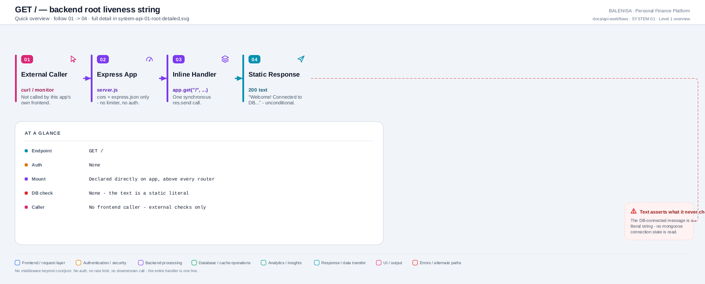
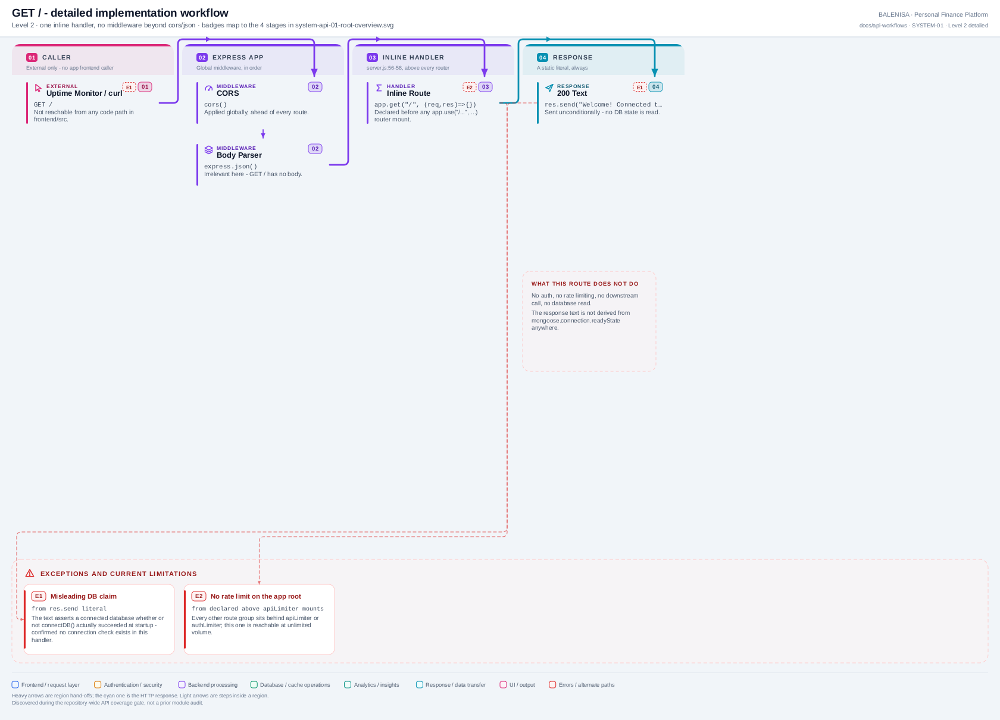

# SYSTEM-01 — Backend root

`GET /`

Discovered during the repository-wide API coverage gate, not during any prior module
audit. Defined directly on the Express `app` object in `backend/server.js` — there is no
router file for it.

## 1. Purpose

A liveness string for whoever hits the backend's bare origin — humans checking the
deployment is up, or a platform's own root health probe. It is not consumed by the
frontend or any other backend module.

## 2. Endpoint and HTTP method

| | |
|---|---|
| **Method** | `GET` |
| **Path** | `/` |
| **Mount** | `app.get("/", ...)` — `backend/server.js:56-58`, declared before every router `app.use(...)` call |
| **Middleware order** | `cors()` → `express.json()` → handler. No `apiLimiter`, no `verifyToken` |
| **Auth** | None |
| **Rate limiting** | None — it sits above the `/api`, `/expense`, etc. `apiLimiter` mounts |
| **Server cache** | None |

## 3. Level 1 quick workflow

<picture>
  <source srcset="system-api-01-root-overview.svg" type="image/svg+xml">
  
</picture>

Vector: [`system-api-01-root-overview.svg`](system-api-01-root-overview.svg) ·
raster fallback: [`system-api-01-root-overview.png`](system-api-01-root-overview.png)

## 4. Level 2 detailed workflow

<picture>
  <source srcset="system-api-01-root-detailed.svg" type="image/svg+xml">
  
</picture>

Vector: [`system-api-01-root-detailed.svg`](system-api-01-root-detailed.svg) ·
raster fallback: [`system-api-01-root-detailed.png`](system-api-01-root-detailed.png)

## 5. Request structure

```http
GET / HTTP/1.1
Host: <backend-host>
```

No headers, body, query string or path parameters are read.

## 6. Request validation behaviour

None. The handler takes no input, so there is nothing to validate.

## 7. Processing behaviour

A single synchronous `res.send(...)` call. No database access, no downstream call, no
computation.

## 8. Response structure

```
Welcome! Connected to DB...
```

Plain text, `200`, always — the string is a static literal and is sent regardless of
actual database connectivity. **The message is misleading**: it does not check
`mongoose.connection.readyState` or call any DB method; it is printed unconditionally
even if `connectDB()` (invoked separately at startup) failed or is still pending.

## 9. Persistence behaviour

None. No read, no write.

## 10. Frontend consumption

**Not called anywhere.** Grepped across `frontend/src` for a fetch/axios call to the bare
backend origin (as opposed to `/api`, `/expense`, etc.) — no match. This route exists for
external/manual checks only (uptime monitors, `curl`, browser visits to the API origin).

## 11. TanStack Query and cache behaviour

Not applicable — no frontend caller.

## 12. Loading, success and error states

Not applicable — no frontend caller, and the handler itself has no failure path (a plain
`res.send` cannot throw in a way Express would catch here).

## 13. Runtime/in-memory effects

None.

## 14. Security and operational behaviour

| Concern | Finding |
|---|---|
| Auth | None — intentionally, for an unauthenticated health string |
| Rate limiting | None — a target for unmetered request volume, though the payload cost is negligible |
| Information disclosure | Low — confirms only that the process is running, not DB state |
| Misleading content | The "Connected to DB..." text is not truth-checked against actual connection state |

## 15. Files involved

| Layer | File | Function/Export | Purpose |
|---|---|---|---|
| Server mount | `backend/server.js` | inline `app.get("/", ...)` | Static liveness string |

## 16. Current implementation observations

**Summary:** Correctness 1 · Security / operational 1 · Reliability 0 · Maintainability 0

### Correctness

1. **The response text asserts a DB connection state it never checks.** `res.send("Welcome!
   Connected to DB...")` is unconditional — confirmed by direct inspection of
   `server.js:56-58`: no reference to `mongoose.connection`, no call into `connectDB`'s
   result, no try/catch. If the database is down, this route still returns the same
   "Connected to DB..." text with a `200`.

### Security / operational

2. **No rate limiting on the app's own root.** Every other route group is behind
   `apiLimiter` or the auth router's own `authLimiter`; this one sits above both, mounted
   before any middleware besides `cors`/`express.json`. Confirmed by inspection: `/` is
   declared at `server.js:56`, ahead of every `app.use("/...", apiLimiter, ...)` line.
